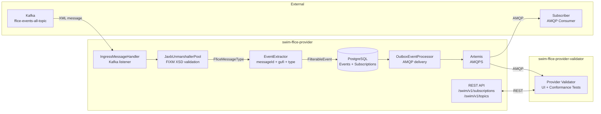

# Tutorial: Building an FF-ICE Provider with SWIM Developer

This tutorial walks through creating a complete SWIM provider service for FF-ICE (Flight and Flow Information for a Collaborative Environment) messages, from the data model to a running application with automated tests.

By the end, you will have three projects:

1. **fixm-ffice-model** — JAXB data model generated from FIXM 4.3 + FF-ICE 1.1 XSD schemas
2. **swim-ffice-provider** — Quarkus provider service that ingests FF-ICE messages from Kafka, validates and persists them, then delivers to subscribers via AMQP
3. **swim-ffice-provider-validator** — AMQP consumer test harness that subscribes to the provider, receives events, and runs conformance tests

## Prerequisites

| Tool | Version | Purpose |
|------|---------|---------|
| JDK | 21+ | Runtime and compilation |
| Maven | 3.9+ | Build system |
| Git | 2.40+ | Source control |
| [Podman Desktop](https://podman-desktop.io) | Latest | Container runtime (includes Podman engine + GUI, available for Linux, macOS, and Windows) |
| mkcert | Latest | Local TLS certificate generation |

All commands in this tutorial are shown for Linux/macOS. Windows equivalents are provided where they differ (primarily `mvnw.cmd` instead of `./mvnw`). On Windows, [Git Bash](https://gitforwindows.org/) or [WSL](https://learn.microsoft.com/en-us/windows/wsl/) can be used to run shell scripts (e.g., `certs/generate.sh`).

## Setup: Install Dependencies

Each SWIM Developer component lives in its own Git repository. Clone and install only what you need.

### Parent POM

```bash
git clone https://github.com/swim-developer/swim-developer
cd swim-developer
./mvnw clean install -DskipTests        # Linux / macOS
mvnw.cmd clean install -DskipTests      # Windows
```

### Framework

```bash
git clone https://github.com/swim-developer/swim-developer-framework
cd swim-developer-framework
./mvnw clean install -DskipTests        # Linux / macOS
mvnw.cmd clean install -DskipTests      # Windows
```

### Extensions

```bash
git clone https://github.com/swim-developer/swim-developer-extensions
cd swim-developer-extensions
./mvnw clean install -DskipTests        # Linux / macOS
mvnw.cmd clean install -DskipTests      # Windows
```

### Validators

```bash
git clone https://github.com/swim-developer/swim-developer-validators
cd swim-developer-validators
./mvnw clean install -DskipTests        # Linux / macOS
mvnw.cmd clean install -DskipTests      # Windows
```

### Model Archetype

```bash
git clone https://github.com/swim-developer/swim-model-archetype
cd swim-model-archetype
mvn clean install
```

### Provider Archetype

```bash
git clone https://github.com/swim-developer/swim-provider-archetype
cd swim-provider-archetype
mvn clean install
```

After this setup, all artifacts are in your local Maven repository (`~/.m2/repository`). You can work from any directory going forward.

---

## Part 1: Data Model (fixm-ffice-model)

> **Note**: If you have already completed the FF-ICE Consumer tutorial, your `fixm-ffice-model` is already built and installed in your local Maven repository. You can skip to Part 2.

### 1.1 Download the XSD schemas

Download the FIXM 4.3 + FF-ICE 1.1 schemas from [fixm.aero](https://www.fixm.aero/). The distribution contains three top-level directories:

```
schemas/
  core/         FIXM 4.3 core (base types, flight types)
  applications/ FF-ICE Application 1.1 (message types, templates)
  extensions/   Bug fix extensions
```

### 1.2 Generate the model project

Choose a working directory for your new project and run:

```bash
mvn archetype:generate \
  -DarchetypeGroupId=com.github.swim-developer \
  -DarchetypeArtifactId=swim-model-archetype \
  -DarchetypeVersion=1.0.0-SNAPSHOT \
  -DgroupId=com.github.swim-developer \
  -DartifactId=fixm-ffice-model \
  -Dversion=1.0.0-SNAPSHOT \
  -Dpackage=aero.fixm.ffice \
  -DmodelName=ffice \
  -DmodelDisplayName="FF-ICE" \
  -DmodelPrefix=Ffice \
  -DrootSchema=FficeMessage.xsd \
  -DdataStandard=FIXM \
  -DinteractiveMode=false
```

Enter the generated project:

```bash
cd fixm-ffice-model
chmod +x mvnw                            # Linux / macOS only
```

On Windows, use `mvnw.cmd` instead of `./mvnw` in all subsequent commands. The `chmod` step is not needed.

### 1.3 Copy the XSD schemas

Copy the three directories from the FIXM distribution into `src/main/resources/schemas/`. Use your file manager or the appropriate command for your OS:

```bash
# Linux / macOS
cp -r /path/to/fixm-distribution/schemas/core       src/main/resources/schemas/
cp -r /path/to/fixm-distribution/schemas/applications src/main/resources/schemas/
cp -r /path/to/fixm-distribution/schemas/extensions  src/main/resources/schemas/
```

```powershell
# Windows (PowerShell)
Copy-Item -Recurse C:\path\to\fixm-distribution\schemas\core       src\main\resources\schemas\
Copy-Item -Recurse C:\path\to\fixm-distribution\schemas\applications src\main\resources\schemas\
Copy-Item -Recurse C:\path\to\fixm-distribution\schemas\extensions  src\main\resources\schemas\
```

The final structure should be:

```
src/main/resources/schemas/
  core/
    base/          Base.xsd, Types.xsd, AeronauticalReference.xsd, ...
    flight/        Flight.xsd, Arrival.xsd, Departure.xsd, ...
  applications/
    fficemessage/  FficeMessage.xsd
      fficetemplates/
        filedflightplan/
        flightdeparture/
        ...
  extensions/
    fficemessagebugfix/  FficeMessageBugFix.xsd
```

### 1.4 Configure the JAXB binding file

Edit `src/main/resources/bindings/ffice.xjb` to map each XSD namespace to a Java package:

```xml
<?xml version="1.0" encoding="UTF-8"?>
<jaxb:bindings xmlns:jaxb="https://jakarta.ee/xml/ns/jaxb"
               xmlns:xjc="http://java.sun.com/xml/ns/jaxb/xjc"
               xmlns:xs="http://www.w3.org/2001/XMLSchema"
               jaxb:extensionBindingPrefixes="xjc"
               version="3.0">

    <jaxb:globalBindings>
        <xjc:serializable uid="1"/>
    </jaxb:globalBindings>

    <jaxb:bindings schemaLocation="../schemas/applications/fficemessage/FficeMessage.xsd" node="/xs:schema">
        <jaxb:schemaBindings>
            <jaxb:package name="aero.fixm.ffice"/>
        </jaxb:schemaBindings>
    </jaxb:bindings>

    <jaxb:bindings schemaLocation="../schemas/core/base/Base.xsd" node="/xs:schema">
        <jaxb:schemaBindings>
            <jaxb:package name="aero.fixm.base"/>
        </jaxb:schemaBindings>
    </jaxb:bindings>

    <jaxb:bindings schemaLocation="../schemas/core/flight/Flight.xsd" node="/xs:schema">
        <jaxb:schemaBindings>
            <jaxb:package name="aero.fixm.flight"/>
        </jaxb:schemaBindings>
    </jaxb:bindings>

    <jaxb:bindings schemaLocation="../schemas/extensions/fficemessagebugfix/FficeMessageBugFix.xsd" node="/xs:schema">
        <jaxb:schemaBindings>
            <jaxb:package name="aero.fixm.ffice.bugfix"/>
        </jaxb:schemaBindings>
    </jaxb:bindings>

</jaxb:bindings>
```

### 1.5 Configure the JAXB Maven plugin

In `pom.xml`, update the `schemaIncludes` inside the `generate-xjc` profile to point to your root schemas:

```xml
<schemaIncludes>
    <include>applications/fficemessage/FficeMessage.xsd</include>
    <include>extensions/fficemessagebugfix/FficeMessageBugFix.xsd</include>
</schemaIncludes>
```

Update the `clean-generated-sources` execution to list the generated packages:

```xml
<target>
    <delete dir="${project.basedir}/src/main/java/aero/fixm/base" failonerror="false"/>
    <delete dir="${project.basedir}/src/main/java/aero/fixm/flight" failonerror="false"/>
    <delete dir="${project.basedir}/src/main/java/aero/fixm/ffice/bugfix" failonerror="false"/>
    <delete failonerror="false">
        <fileset dir="${project.basedir}/src/main/java/aero/fixm/ffice" includes="*.java"/>
    </delete>
</target>
```

### 1.6 Generate JAXB classes

```bash
./mvnw process-sources -Pgenerate-xjc        # Linux / macOS
mvnw.cmd process-sources -Pgenerate-xjc      # Windows
```

This generates Java classes from the XSD schemas and copies them into `src/main/java/`. The hand-written `FficeUnmarshallerPool` and `FficeXsdValidator` in the `validation` package are preserved.

### 1.7 Update the UnmarshallerPool

Edit `src/main/java/aero/fixm/ffice/validation/FficeUnmarshallerPool.java` and register all generated `ObjectFactory` classes in the `JAXBContext`:

```java
this.jaxbContext = JAXBContext.newInstance(
    aero.fixm.ffice.ObjectFactory.class,
    aero.fixm.base.ObjectFactory.class,
    aero.fixm.flight.ObjectFactory.class,
    aero.fixm.ffice.bugfix.ObjectFactory.class);
```

Set the `ROOT_XSD` constant to match the path of your root schema on the classpath:

```java
private static final String ROOT_XSD = "schemas/applications/fficemessage/FficeMessage.xsd";
```

### 1.8 Build and install

```bash
./mvnw clean install -DskipTests        # Linux / macOS
mvnw.cmd clean install -DskipTests      # Windows
```

---

## Part 2: Provider Service (swim-ffice-provider)

The provider is a Quarkus service that:

- **Ingests** FF-ICE messages from a Kafka topic (`ffice-events-all-topic`)
- **Validates** each message against the FIXM/FF-ICE XSD schemas via JAXB
- **Persists** valid events in PostgreSQL with `RECEIVED` status
- **Delivers** events asynchronously to subscribed consumers via AMQP (ActiveMQ Artemis)
- **Exposes** the SWIM Subscription Manager REST API (`/swim/v1/subscriptions`, `/swim/v1/topics`)

### 2.1 Generate the provider project

Run the archetype from your working directory:

```bash
mvn archetype:generate \
  -DarchetypeGroupId=com.github.swim-developer \
  -DarchetypeArtifactId=swim-provider-archetype \
  -DarchetypeVersion=1.0.0-SNAPSHOT \
  -DgroupId=com.github.swim-developer \
  -DartifactId=swim-ffice-provider \
  -Dversion=1.0.0-SNAPSHOT \
  -Dpackage=com.github.swim_developer.ffice.provider \
  -DserviceName=ffice \
  -DserviceDisplayName="FF-ICE" \
  -DservicePrefix=Ffice \
  -DdataModel=FIXM \
  -DtablePrefix=ffice \
  -DqueuePrefix=FFICE \
  -DtopicName=FficeService \
  -DinteractiveMode=false
```

Enter the generated project and make the Maven wrapper executable:

```bash
cd swim-ffice-provider
chmod +x mvnw                            # Linux / macOS only
```

### 2.2 Add the data model dependency

In `pom.xml`, add the `fixm-ffice-model` dependency after the `swim-framework-provider` dependency:

```xml
<dependency>
    <groupId>com.github.swim-developer</groupId>
    <artifactId>fixm-ffice-model</artifactId>
    <version>1.0.0-SNAPSHOT</version>
</dependency>
```

Also in `pom.xml`, add the following test dependencies after the `fixm-ffice-model` dependency. These enable the broker security and mTLS integration tests:

```xml
<dependency>
    <groupId>com.github.swim-developer</groupId>
    <artifactId>swim-framework-core</artifactId>
    <version>${project.version}</version>
    <type>test-jar</type>
    <scope>test</scope>
</dependency>
<dependency>
    <groupId>org.testcontainers</groupId>
    <artifactId>testcontainers</artifactId>
    <scope>test</scope>
</dependency>
<dependency>
    <groupId>org.testcontainers</groupId>
    <artifactId>testcontainers-junit-jupiter</artifactId>
    <scope>test</scope>
</dependency>
<dependency>
    <groupId>org.awaitility</groupId>
    <artifactId>awaitility</artifactId>
    <scope>test</scope>
</dependency>
<dependency>
    <groupId>org.bouncycastle</groupId>
    <artifactId>bcprov-jdk18on</artifactId>
    <version>1.84</version>
    <scope>test</scope>
</dependency>
<dependency>
    <groupId>org.bouncycastle</groupId>
    <artifactId>bcpkix-jdk18on</artifactId>
    <version>1.84</version>
    <scope>test</scope>
</dependency>
```

The `swim-framework-core` test-jar exposes `ArtemisTlsContainer` and `TlsTestCertificateGenerator`, used by the mTLS test. BouncyCastle provides the cryptography primitives for TLS certificate generation. The `testcontainers` and `testcontainers-junit-jupiter` artifacts manage container lifecycle in tests. `awaitility` is used by some framework test utilities.

Also in `pom.xml`, add the `maven-failsafe-plugin` inside the `<build><plugins>` section to enable integration test execution. The archetype does not generate this plugin by default:

```xml
<plugin>
    <artifactId>maven-surefire-plugin</artifactId>
    <configuration>
        <systemPropertyVariables>
            <java.util.logging.manager>org.jboss.logmanager.LogManager</java.util.logging.manager>
        </systemPropertyVariables>
    </configuration>
</plugin>
<plugin>
    <artifactId>maven-failsafe-plugin</artifactId>
    <executions>
        <execution>
            <goals>
                <goal>integration-test</goal>
                <goal>verify</goal>
            </goals>
        </execution>
    </executions>
    <configuration>
        <systemPropertyVariables>
            <java.util.logging.manager>org.jboss.logmanager.LogManager</java.util.logging.manager>
            <maven.home>${maven.home}</maven.home>
        </systemPropertyVariables>
    </configuration>
</plugin>
```

### 2.3 Define the filterable event model

The `FilterableEvent` record carries the metadata used by the delivery engine to match events against subscription filters. Replace the generated placeholder in `src/main/java/.../domain/model/FilterableEvent.java`:

```java
package com.github.swim_developer.ffice.provider.domain.model;

import io.quarkus.runtime.annotations.RegisterForReflection;

@RegisterForReflection
public record FilterableEvent(
        String messageId,
        String gufi,
        String messageType,
        String payload
) {
}
```

The four fields map directly to what the framework's delivery engine uses:
- `messageId` — uniqueness key (maps to `eventId` in the database)
- `gufi` — Globally Unique Flight Identifier
- `messageType` — `FILED_FLIGHT_PLAN`, `FLIGHT_PLAN_UPDATE`, `DEPARTURE`, `ARRIVAL`, etc.
- `payload` — the raw XML (set to `null` at extraction time; populated later by the outbox processor)

### 2.3.1 Customize the stored event domain model

The archetype generates `StoredEvent.java` with only the base fields (`eventId`, `xmlMessage`, `status`). You must add the FF-ICE specific fields that the ingress handler and persistence layer need.

Replace the generated placeholder in `src/main/java/.../domain/model/StoredEvent.java`:

```java
package com.github.swim_developer.ffice.provider.domain.model;

import com.github.swim_developer.framework.domain.model.EventStatus;
import com.github.swim_developer.framework.domain.model.SwimProviderEvent;
import lombok.AllArgsConstructor;
import lombok.Builder;
import lombok.Data;
import lombok.NoArgsConstructor;

import java.time.Instant;

@Data
@Builder
@NoArgsConstructor
@AllArgsConstructor
public class StoredEvent implements SwimProviderEvent {

    private String eventId;
    private String gufi;
    private String messageType;

    @Builder.Default
    private EventStatus status = EventStatus.RECEIVED;

    @Builder.Default
    private Instant receivedAt = Instant.now();

    private Instant processedAt;

    @Builder.Default
    private int deliveredCount = 0;

    @Builder.Default
    private int retryCount = 0;

    private String xmlMessage;

    @Override
    public String getPayload() {
        return xmlMessage;
    }
}
```

Also update `src/main/java/.../infrastructure/out/persistence/entity/EventJpaEntity.java` to add the corresponding database columns:

```java
@Id @Column(length = 100)
private String eventId;

@Column(length = 255)
private String gufi;

@Column(length = 50)
private String messageType;
```

Add these two fields immediately after `private String eventId;` in the generated class. The remaining fields (`status`, `receivedAt`, `processedAt`, `deliveredCount`, `retryCount`, `xmlMessage`) remain as generated.

### 2.4 Implement the JAXB unmarshaller pool

Create `src/main/java/.../infrastructure/out/xml/JaxbUnmarshallerPool.java` as a thin adapter that delegates to the model's `FficeUnmarshallerPool`:

```java
package com.github.swim_developer.ffice.provider.infrastructure.out.xml;

import aero.fixm.ffice.FficeMessageType;
import aero.fixm.ffice.validation.FficeUnmarshallerPool;
import com.github.swim_developer.framework.application.port.out.SwimXmlUnmarshallerPort;
import com.github.swim_developer.framework.domain.exception.XmlValidationException;
import jakarta.annotation.PostConstruct;
import jakarta.enterprise.context.ApplicationScoped;
import lombok.extern.slf4j.Slf4j;

@Slf4j
@ApplicationScoped
public class JaxbUnmarshallerPool implements SwimXmlUnmarshallerPort<FficeMessageType> {

    private FficeUnmarshallerPool pool;

    @PostConstruct
    void initialize() {
        this.pool = new FficeUnmarshallerPool();
        log.info("FF-ICE JAXB unmarshaller pool initialized from fixm-ffice-model");
    }

    @Override
    public FficeMessageType unmarshalAndValidate(String xml) throws XmlValidationException {
        try {
            Object result = pool.unmarshalAndValidate(xml);
            if (result instanceof FficeMessageType message) {
                return message;
            }
            throw new XmlValidationException("Unexpected root type from FF-ICE unmarshaller: "
                    + (result != null ? result.getClass().getName() : "null"));
        } catch (FficeUnmarshallerPool.FficeUnmarshalException e) {
            throw new XmlValidationException(e.getMessage(), e);
        }
    }
}
```

### 2.5 Implement the event extractor

Create `src/main/java/.../infrastructure/out/xml/EventExtractor.java`. This class reads a fully-parsed `FficeMessageType` and returns a `FilterableEvent` with the identifiers needed for routing and deduplication:

```java
package com.github.swim_developer.ffice.provider.infrastructure.out.xml;

import aero.fixm.ffice.FficeMessageType;
import aero.fixm.ffice.MessageTypeType;
import aero.fixm.base.UniversallyUniqueIdentifierType;
import aero.fixm.flight.FlightIdentificationType;
import aero.fixm.flight.FlightType;
import com.github.swim_developer.ffice.provider.domain.model.FilterableEvent;
import com.github.swim_developer.framework.application.port.out.SwimEventExtractor;
import jakarta.enterprise.context.ApplicationScoped;
import jakarta.xml.bind.JAXBElement;
import lombok.extern.slf4j.Slf4j;

import java.util.List;
import java.util.Optional;

@Slf4j
@ApplicationScoped
public class EventExtractor implements SwimEventExtractor<FilterableEvent, FficeMessageType> {

    private static final String UNKNOWN = "unknown";

    @Override
    public List<Optional<FilterableEvent>> extract(FficeMessageType message) {
        if (message == null) {
            return List.of(Optional.empty());
        }

        try {
            String messageId = extractMessageId(message);
            String gufi = extractGufi(message);
            String messageType = extractMessageType(message);

            FilterableEvent event = new FilterableEvent(messageId, gufi, messageType, null);
            return List.of(Optional.of(event));
        } catch (RuntimeException e) {
            log.error("Failed to extract FF-ICE event metadata from message", e);
            return List.of(Optional.empty());
        }
    }

    private String extractMessageId(FficeMessageType message) {
        UniversallyUniqueIdentifierType uid = message.getUniqueMessageIdentifier();
        if (uid != null && uid.getValue() != null && !uid.getValue().isBlank()) {
            return uid.getValue();
        }
        return UNKNOWN;
    }

    private String extractGufi(FficeMessageType message) {
        FlightType flight = message.getFlight();
        if (flight == null) {
            return UNKNOWN;
        }
        JAXBElement<FlightIdentificationType> flightIdElement = flight.getFlightIdentification();
        if (flightIdElement == null || flightIdElement.getValue() == null) {
            return UNKNOWN;
        }
        FlightIdentificationType flightId = flightIdElement.getValue();
        JAXBElement<aero.fixm.base.GloballyUniqueFlightIdentifierType> gufiElement = flightId.getGufi();
        if (gufiElement == null || gufiElement.getValue() == null) {
            return UNKNOWN;
        }
        String value = gufiElement.getValue().getValue();
        return (value != null && !value.isBlank()) ? value : UNKNOWN;
    }

    private String extractMessageType(FficeMessageType message) {
        MessageTypeType type = message.getType();
        if (type != null) {
            return type.value();
        }
        return UNKNOWN;
    }
}
```

### 2.6 Implement the ingress message handler

The ingress handler is called by the Kafka consumer for each incoming message. It orchestrates validation, extraction, persistence, and async delivery dispatch. Replace the generated placeholder in `src/main/java/.../infrastructure/in/amqp/IngressMessageHandler.java`:

```java
package com.github.swim_developer.ffice.provider.infrastructure.in.amqp;

import aero.fixm.ffice.FficeMessageType;
import com.github.swim_developer.ffice.provider.domain.model.FilterableEvent;
import com.github.swim_developer.ffice.provider.domain.model.StoredEvent;
import com.github.swim_developer.ffice.provider.infrastructure.out.messaging.OutboxEventProcessor;
import com.github.swim_developer.ffice.provider.infrastructure.out.persistence.ProviderEventStore;
import com.github.swim_developer.ffice.provider.infrastructure.out.xml.EventExtractor;
import com.github.swim_developer.ffice.provider.infrastructure.out.xml.JaxbUnmarshallerPool;
import com.github.swim_developer.framework.application.port.in.SwimIngressHandler;
import com.github.swim_developer.framework.domain.exception.XmlValidationException;
import com.github.swim_developer.framework.domain.model.EventStatus;
import com.github.swim_developer.framework.infrastructure.out.cache.HandoffCache;
import com.github.swim_developer.framework.provider.application.messaging.AfterCommitEventDispatcher;
import io.micrometer.core.instrument.Counter;
import io.micrometer.core.instrument.MeterRegistry;
import io.micrometer.core.instrument.Timer;
import io.opentelemetry.api.trace.Span;
import io.opentelemetry.instrumentation.annotations.WithSpan;
import io.vertx.core.Vertx;
import jakarta.enterprise.context.ApplicationScoped;
import jakarta.inject.Inject;
import jakarta.transaction.TransactionSynchronizationRegistry;
import jakarta.transaction.Transactional;
import lombok.extern.slf4j.Slf4j;
import org.eclipse.microprofile.faulttolerance.Bulkhead;
import org.eclipse.microprofile.faulttolerance.CircuitBreaker;
import org.eclipse.microprofile.faulttolerance.Retry;
import org.eclipse.microprofile.faulttolerance.Timeout;

import java.time.temporal.ChronoUnit;
import java.util.Optional;

@ApplicationScoped
@Slf4j
public class IngressMessageHandler implements SwimIngressHandler {

    private static final String FAILED_STATUS = "failed";

    private final ProviderEventStore eventRepository;
    private final EventExtractor eventExtractor;
    private final JaxbUnmarshallerPool jaxbPool;
    private final HandoffCache handoffCache;
    private final Vertx vertx;
    private final MeterRegistry registry;
    private final TransactionSynchronizationRegistry txSyncRegistry;

    @Inject
    public IngressMessageHandler(ProviderEventStore eventRepository,
                                 EventExtractor eventExtractor,
                                 JaxbUnmarshallerPool jaxbPool,
                                 HandoffCache handoffCache,
                                 Vertx vertx,
                                 MeterRegistry registry,
                                 TransactionSynchronizationRegistry txSyncRegistry) {
        this.eventRepository = eventRepository;
        this.eventExtractor = eventExtractor;
        this.jaxbPool = jaxbPool;
        this.handoffCache = handoffCache;
        this.vertx = vertx;
        this.registry = registry;
        this.txSyncRegistry = txSyncRegistry;
    }

    @Override
    @Transactional
    @Retry(maxRetries = 2, delay = 500)
    @Timeout(value = 10, unit = ChronoUnit.SECONDS)
    @CircuitBreaker(requestVolumeThreshold = 10, failureRatio = 0.5, delay = 30000)
    @Bulkhead(value = 100)
    @WithSpan("ffice.provider.process")
    public void processEvent(String xmlMessage) {
        Timer.Sample timerSample = Timer.start(registry);

        FficeMessageType parsed;
        try {
            parsed = jaxbPool.unmarshalAndValidate(xmlMessage);
        } catch (XmlValidationException e) {
            Span.current().setAttribute("ffice.validation", FAILED_STATUS);
            log.warn("FF-ICE JAXB validation failed — event rejected: {}", e.getMessage());
            incrementFailedCounter("jaxb_validation_failed");
            return;
        }

        Optional<FilterableEvent> extracted = eventExtractor.extract(parsed).stream()
                .filter(Optional::isPresent)
                .map(Optional::get)
                .findFirst();

        if (extracted.isEmpty()) {
            Span.current().setAttribute("ffice.extraction", FAILED_STATUS);
            log.warn("Failed to extract FF-ICE event from message");
            incrementFailedCounter("extraction_failed");
            return;
        }

        FilterableEvent event = extracted.get();
        String messageId = event.messageId();
        String gufi = event.gufi();
        String messageType = event.messageType();

        incrementReceivedCounter(messageType);

        Span.current().setAttribute("ffice.messageId", messageId);
        Span.current().setAttribute("ffice.gufi", gufi);
        Span.current().setAttribute("ffice.messageType", messageType);

        StoredEvent entity = persistWithStatusReceived(messageId, gufi, messageType, xmlMessage);
        if (entity == null) {
            Span.current().setAttribute("ffice.persist", FAILED_STATUS);
            return;
        }

        Span.current().setAttribute("ffice.persist", "success");
        dispatchForAsyncDelivery(entity);

        timerSample.stop(Timer.builder("ffice_event_processing_duration")
                .description("Time to process and persist an FF-ICE event")
                .tag("type", messageType)
                .register(registry));

        log.info("Event persisted and dispatched - MessageId: {}, GUFI: {}, Type: {}", messageId, gufi, messageType);
    }

    private StoredEvent persistWithStatusReceived(String messageId, String gufi, String messageType, String xml) {
        try {
            StoredEvent existing = eventRepository.findDomainById(messageId);
            if (existing != null) {
                existing.setGufi(gufi);
                existing.setMessageType(messageType);
                existing.setXmlMessage(xml);
                existing.setStatus(EventStatus.RECEIVED);
                existing.setDeliveredCount(0);
                existing.setRetryCount(0);
                existing.setProcessedAt(null);
                eventRepository.update(existing);
                incrementPersistedCounter();
                return existing;
            }

            StoredEvent entity = StoredEvent.builder()
                    .eventId(messageId)
                    .gufi(gufi)
                    .messageType(messageType)
                    .xmlMessage(xml)
                    .status(EventStatus.RECEIVED)
                    .build();
            eventRepository.persist(entity);
            incrementPersistedCounter();
            return entity;
        } catch (Exception e) {
            log.error("Failed to persist FF-ICE event: {}", messageId, e);
            incrementFailedCounter("persistence_failed");
            return null;
        }
    }

    private void dispatchForAsyncDelivery(StoredEvent entity) {
        txSyncRegistry.registerInterposedSynchronization(
                new AfterCommitEventDispatcher(entity.getEventId(), entity, handoffCache, vertx,
                        OutboxEventProcessor.OUTBOX_EVENT_ADDRESS));
    }

    private void incrementReceivedCounter(String messageType) {
        Counter.builder("ffice_events_received_total")
                .description("Total FF-ICE events received from Kafka")
                .tag("type", messageType)
                .register(registry)
                .increment();
    }

    private void incrementPersistedCounter() {
        Counter.builder("ffice_events_persisted_total")
                .description("Total FF-ICE events persisted to database with RECEIVED status")
                .register(registry)
                .increment();
    }

    private void incrementFailedCounter(String reason) {
        Counter.builder("ffice_events_failed_total")
                .description("Total FF-ICE events that failed processing")
                .tag("reason", reason)
                .register(registry)
                .increment();
    }
}
```

### 2.7 Implement the subscription store

The subscription store is the only persistence adapter you must implement manually. Open `src/main/java/.../infrastructure/out/persistence/JpaSubscriptionStore.java` and implement the three abstract methods inherited from `SwimSubscriptionRepository`:

```java
@Override
public List<Subscription> findByUserId(String userId) {
    return list("userId", userId).stream().map(mapper::toDomain).toList();
}

@Override
public boolean existsActiveOrPausedByQueue(String queue) {
    return count("queue = ?1 and (status = ?2 or status = ?3)", queue,
            SubscriptionStatus.ACTIVE, SubscriptionStatus.PAUSED) > 0;
}

@Override
public Optional<Subscription> findActiveOrPausedByQueueAndUser(String queue, String userId) {
    return find("queue = ?1 and userId = ?2 and (status = ?3 or status = ?4)",
            queue, userId, SubscriptionStatus.ACTIVE, SubscriptionStatus.PAUSED)
            .firstResultOptional().map(mapper::toDomain);
}
```

Also implement the `toFilterableModel` method in `src/main/java/.../application/usecase/EventDeliveryUseCase.java`:

```java
@Override
protected FilterableEvent toFilterableModel(StoredEvent entity) {
    return new FilterableEvent(entity.getEventId(), entity.getGufi(),
            entity.getMessageType(), entity.getXmlMessage());
}
```

### 2.7.1 Customize the subscription domain model

The archetype generates subscription classes with placeholder TODOs. You must add the FF-ICE specific filter field (`messageType`) to each of them.

**`src/main/java/.../domain/model/Subscription.java`** — add `messageType` field and implement `toFilter()`:

```java
import java.util.ArrayList;
import java.util.List;
import java.util.function.Predicate;

// Remove the TODO comment, add this field after `private String queue;`:
@Builder.Default
private List<String> messageType = new ArrayList<>();

// Replace the toFilter() method:
@Override
public Predicate<FilterableEvent> toFilter() {
    return event -> event != null
            && matchesList(messageType, event.messageType());
}

private static boolean matchesList(List<String> allowed, String value) {
    if (allowed == null || allowed.isEmpty()) return true;
    if (value == null) return false;
    return allowed.stream().anyMatch(s -> s.equalsIgnoreCase(value));
}
```

**`src/main/java/.../infrastructure/in/rest/dto/SubscriptionRequest.java`** — add `message_type`:

```java
import java.util.List;

// Add to the record parameters (remove the TODO comment):
@JsonProperty("message_type") @JsonAlias("messageType") List<String> messageType,
```

**`src/main/java/.../domain/model/SubscriptionCommand.java`** — add `messageType`:

```java
import java.util.List;

// Add to the record parameters (remove the TODO comment):
List<String> messageType,
```

**`src/main/java/.../domain/model/SubscriptionResult.java`** — add `messageType`:

```java
import java.util.List;

// Add to the record parameters (remove the TODO comment):
List<String> messageType,
```

**`src/main/java/.../infrastructure/in/rest/dto/SubscriptionResponse.java`** — add `message_type`:

```java
import java.util.List;

// Add to the record parameters (remove the TODO comment):
@JsonProperty("message_type") List<String> messageType,
```

### 2.7.2 Customize the subscription JPA entity and mappers

**`src/main/java/.../infrastructure/out/persistence/entity/SubscriptionJpaEntity.java`** — add `messageType` column (remove the TODO comment and add after `private String topic;`):

```java
import com.github.swim_developer.framework.provider.infrastructure.out.converter.StringListConverter;
import java.util.ArrayList;
import java.util.List;

@Column(columnDefinition = "TEXT")
@Convert(converter = StringListConverter.class)
@Builder.Default
private List<String> messageType = new ArrayList<>();
```

**`src/main/java/.../infrastructure/out/persistence/ProviderPersistenceMapper.java`** — add `messageType` to both directions (remove the TODO comment):

```java
// In toJpa(Subscription domain):
.messageType(domain.getMessageType())

// In toDomain(SubscriptionJpaEntity jpa):
.messageType(jpa.getMessageType())
```

**`src/main/java/.../infrastructure/in/rest/mapper/ProviderSubscriptionMapper.java`** — pass `messageType` through (remove the TODO comment):

```java
// In toCommand(SubscriptionRequest request):
request.messageType(),    // add after queueName

// In toResponse(SubscriptionResult result):
result.messageType(),     // add after heartbeatQueue
```

**`src/main/java/.../infrastructure/out/mapper/ProviderSubscriptionMappingAdapter.java`** — build subscription with `messageType` and return it in response (remove the TODO comment):

```java
// In toEntity(...), add to Subscription.builder():
.messageType(command.messageType() != null ? command.messageType() : new java.util.ArrayList<>())

// In toResponse(Subscription sub), add to SubscriptionResult constructor after heartbeatQueue:
sub.getMessageType(),
```

### 2.8 Configure the application

The archetype-generated `application.properties` is missing one mandatory property. Open `src/main/resources/application.properties` and add the following line under the `# --- SWIM Domain ---` comment block:

```properties
swim.amq.role.suffix=-swim-ffice-v1-amq-role
```

This property determines the Artemis security role suffix used for queue access control. Without it, the application fails to start.

Create `src/main/resources/application-dev.properties` for the local development profile. This file configures the provider to connect to the infrastructure started by `compose.yml`:

```properties
# --- Database ---
quarkus.hibernate-orm.schema-management.strategy=drop-and-create
quarkus.datasource.username=postgres
quarkus.datasource.password=postgres
quarkus.datasource.jdbc.url=jdbc:postgresql://localhost:5432/swim-ffice

# --- Messaging ---
amqp-host=localhost
amqp-port=5671
amqp-username=admin
amqp-password=admin
kafka.bootstrap.servers=localhost:9092
artemis.broker.name=amq-broker

# --- AMQP TLS ---
mp.messaging.outgoing.ffice-amqp-out.use-ssl=true
mp.messaging.outgoing.ffice-amqp-out.sni-server-name=${amqp-host}
mp.messaging.outgoing.ffice-amqp-out.tls-configuration-name=amqp-client

quarkus.tls.amqp-client.trust-store.pem.certs=certs/ca.crt
quarkus.tls.amqp-client.key-store.pem.0.cert=certs/client.crt
quarkus.tls.amqp-client.key-store.pem.0.key=certs/client.key

# --- HTTPS ---
quarkus.http.ssl.certificate.files=certs/tls.crt
quarkus.http.ssl.certificate.key-files=certs/tls.key
quarkus.http.ssl.certificate.trust-store-file=certs/ca.crt
quarkus.http.ssl.certificate.trust-store-file-type=PEM
quarkus.http.ssl.client-auth=request
quarkus.http.insecure-requests=enabled

# --- OIDC ---
quarkus.oidc.enabled=true
quarkus.oidc.auth-server-url=https://keycloak.swim.lab:8543/realms/swim
quarkus.oidc.credentials.secret=BtYGyfj6R1YvoKhEsDfjg0aMxSc8VyJ5
quarkus.tls.trust-all=true
quarkus.security.auth.enabled-in-dev-mode=true

# --- Heartbeat ---
swim.heartbeat.interval=10s
swim.heartbeat.provider-id=ffice-provider-dev

# --- Subscription Expiry ---
swim.subscription.expiry.check-interval=30s
swim.subscription.expiry.purge-delay=5m
swim.subscription.expiry.default-ttl=1h

# --- DevServices (DISABLED — use compose.yml) ---
quarkus.devservices.enabled=false

# --- OpenTelemetry (DISABLED in dev) ---
quarkus.otel.enabled=false
quarkus.otel.sdk.disabled=true

# --- OpenAPI ---
mp.openapi.servers=${OPENAPI_SERVERS:https://localhost:8443,http://localhost:8080}

# --- Logging ---
quarkus.log.level=INFO
quarkus.log.file.enabled=true
quarkus.log.file.path=target/app.log
```

Create `src/main/resources/application-test.properties` for the automated test profile. Tests use Quarkus DevServices (Testcontainers) and have messaging and fault-tolerance disabled:

```properties
# --- Database ---
quarkus.hibernate-orm.schema-management.strategy=drop-and-create

# --- OIDC ---
quarkus.oidc.auth-server-url=http://localhost:0/realms/test

# --- SSL/TLS (DISABLED for tests) ---
quarkus.http.ssl.certificate.files=
quarkus.http.ssl.certificate.key-files=
quarkus.http.ssl.certificate.trust-store-file=
quarkus.http.ssl.client-auth=none
quarkus.http.insecure-requests=enabled
quarkus.http.test-ssl-port=-1

# --- Security (permit all for tests) ---
quarkus.http.auth.permission.swim-api.policy=permit

# --- Messaging (DISABLED) ---
mp.messaging.incoming.ffice-events.enabled=false
mp.messaging.outgoing.ffice-amqp-out.enabled=false

# --- OpenTelemetry (DISABLED) ---
quarkus.otel.sdk.disabled=true

# --- Schedulers / Fault Tolerance (DISABLED) ---
quarkus.scheduler.enabled=false
quarkus.fault-tolerance.enabled=false

# --- SWIM Domain ---
swim.topics=FficeService,TestTopic
swim.heartbeat.enabled=false
swim.heartbeat.provider-id=test-provider
swim.heartbeat.interval=999d
swim.kubernetes.namespace=test
swim.subscription.expiry.check-interval=999d
swim.subscription.expiry.purge-interval=999d

# --- Messaging overrides ---
amqp-host=localhost
artemis.broker.name=test-broker

# --- Logging ---
quarkus.log.console.enabled=true
quarkus.log.console.level=WARN
```

### 2.9 Build

```bash
./mvnw clean package -DskipTests        # Linux / macOS
mvnw.cmd clean package -DskipTests      # Windows
```

The build must succeed with `BUILD SUCCESS` before proceeding.

---

## Part 3: Provider Validator (swim-ffice-provider-validator)

The provider validator is a Quarkus application that acts as a SWIM consumer to test your provider. It:

- **Subscribes** to the provider's REST API (`/swim/v1/subscriptions`)
- **Connects** to Artemis via AMQPS with mTLS and receives FF-ICE events
- **Persists** received messages in MariaDB
- **Runs** conformance tests against the provider's API
- **Exposes** REST endpoints for message inspection and conformance scenarios

Create the project under `applications/swim-validators/swim-ffice-provider-validator/`.

### 3.1 Project structure

```
swim-ffice-provider-validator/
  pom.xml
  compose.yml
  src/main/docker/Containerfile.jvm
  src/main/resources/application.properties
  src/main/java/com/github/swim_developer/validator/ffice/provider/
    application/usecase/
      ConformanceAssertions.java
      ConformanceTestService.java
      ConsoleService.java
      FficeMessageExtractor.java
      MessageService.java
      SubscriptionService.java
    domain/model/
      FficeMessage.java
      HttpResult.java
      ReceivedMessage.java
    domain/port/in/
      ConformanceHttpPort.java
      ConformanceTestPort.java
      ConnectionTrackerPort.java
      ConsoleNotificationPort.java
      MessagePersistencePort.java
      MessagePort.java
      ProviderSubscriptionPort.java
    domain/port/out/
      ReceivedMessageRepository.java
    infrastructure/client/
      ConformanceHttpClient.java
      ProviderHttpClient.java
    infrastructure/messaging/
      AmqpConnectionCleanupScheduler.java
      AmqpSslConfigurator.java
      UserConnectionTracker.java
      UserReceiverLifecycle.java
    infrastructure/persistence/
      ReceivedMessageMapper.java
      ReceivedMessageRepositoryImpl.java
      entity/ReceivedMessageEntity.java
    infrastructure/rest/
      AmqpApiResource.java
      ApiResource.java
      ConformanceTestResource.java
      MessageResource.java
      ProviderProxyResource.java
      dto/ReceivedMessageDto.java
  src/test/java/com/github/swim_developer/validator/ffice/provider/
    FficeMessageExtractorTest.java
```

### 3.2 pom.xml

```xml
<?xml version="1.0" encoding="UTF-8"?>
<project xmlns="http://maven.apache.org/POM/4.0.0"
         xmlns:xsi="http://www.w3.org/2001/XMLSchema-instance"
         xsi:schemaLocation="http://maven.apache.org/POM/4.0.0 https://maven.apache.org/xsd/maven-4.0.0.xsd">
    <modelVersion>4.0.0</modelVersion>

    <parent>
        <groupId>com.github.swim-developer</groupId>
        <artifactId>swim-validators</artifactId>
        <version>1.0.0-SNAPSHOT</version>
        <relativePath/>
    </parent>

    <artifactId>swim-ffice-provider-validator</artifactId>
    <name>SWIM FF-ICE Provider Validator</name>
    <description>Validates FF-ICE provider implementations — mTLS proxy, AMQP message capture, and conformance testing for FF-ICE Flight Information providers</description>

    <dependencies>
        <dependency>
            <groupId>com.github.swim-developer</groupId>
            <artifactId>swim-validator-provider</artifactId>
        </dependency>
        <dependency>
            <groupId>io.vertx</groupId>
            <artifactId>vertx-web-client</artifactId>
        </dependency>
        <dependency>
            <groupId>org.projectlombok</groupId>
            <artifactId>lombok</artifactId>
            <scope>provided</scope>
        </dependency>
        <dependency>
            <groupId>io.quarkus</groupId>
            <artifactId>quarkus-junit5</artifactId>
            <scope>test</scope>
        </dependency>
        <dependency>
            <groupId>io.rest-assured</groupId>
            <artifactId>rest-assured</artifactId>
            <scope>test</scope>
        </dependency>
        <dependency>
            <groupId>org.assertj</groupId>
            <artifactId>assertj-core</artifactId>
            <scope>test</scope>
        </dependency>
    </dependencies>

    <build>
        <plugins>
            <plugin>
                <groupId>${quarkus.platform.group-id}</groupId>
                <artifactId>quarkus-maven-plugin</artifactId>
                <version>${quarkus.platform.version}</version>
                <extensions>true</extensions>
                <executions>
                    <execution>
                        <goals>
                            <goal>build</goal>
                            <goal>generate-code</goal>
                            <goal>generate-code-tests</goal>
                            <goal>native-image-agent</goal>
                        </goals>
                    </execution>
                </executions>
            </plugin>
            <plugin>
                <artifactId>maven-compiler-plugin</artifactId>
                <configuration>
                    <parameters>true</parameters>
                </configuration>
            </plugin>
            <plugin>
                <artifactId>maven-surefire-plugin</artifactId>
                <configuration>
                    <systemPropertyVariables>
                        <java.util.logging.manager>org.jboss.logmanager.LogManager</java.util.logging.manager>
                        <maven.home>${maven.home}</maven.home>
                    </systemPropertyVariables>
                </configuration>
            </plugin>
        </plugins>
    </build>
</project>
```

### 3.3 application.properties

```properties
# =============================================================================
# SWIM FF-ICE Provider Validator
# =============================================================================
quarkus.application.name=swim-ffice-provider-validator
quarkus.http.port=${QUARKUS_HTTP_PORT:8080}
quarkus.ssl.native=true

# --- Keycloak (OAuth2/OIDC) ---
keycloak.url=${KEYCLOAK_URL:https://rhbk.apps.<your-cluster-domain>}
keycloak.realm=${KEYCLOAK_REALM:swim}
keycloak.client-id=${KEYCLOAK_CLIENT_ID:swim-public-client}

# --- SWIM Provider API ---
swim.provider.api.urls=${SWIM_PROVIDER_API_URLS:https://swim-ffice-provider-mtls-swim-sandbox.apps.<your-cluster-domain>}

# --- mTLS Configuration ---
proxy.mtls.keystore.path=${PROXY_MTLS_KEYSTORE_PATH:certs/keystore.p12}
proxy.mtls.keystore.password=${PROXY_MTLS_KEYSTORE_PASSWORD:changeit}
proxy.mtls.keystore.type=${PROXY_MTLS_KEYSTORE_TYPE:PKCS12}
proxy.mtls.truststore.path=${PROXY_MTLS_TRUSTSTORE_PATH:certs/truststore.p12}
proxy.mtls.truststore.password=${PROXY_MTLS_TRUSTSTORE_PASSWORD:changeit}
proxy.mtls.truststore.type=${PROXY_MTLS_TRUSTSTORE_TYPE:PKCS12}

# --- Database: MariaDB ---
quarkus.datasource.db-kind=mariadb
quarkus.hibernate-orm.schema-management.strategy=update
quarkus.datasource.jdbc.min-size=2
quarkus.datasource.jdbc.max-size=10

%prod.quarkus.datasource.jdbc.url=jdbc:mariadb://${MARIADB_HOST:localhost}:${MARIADB_PORT:3306}/${MARIADB_DATABASE:swim_ffice_provider_validator}
%prod.quarkus.datasource.username=${MARIADB_USERNAME:swim}
%prod.quarkus.datasource.password=${MARIADB_PASSWORD:swim}

%dev.quarkus.datasource.jdbc.url=jdbc:mariadb://localhost:3311/swim_ffice_provider_validator
%dev.quarkus.datasource.username=swim
%dev.quarkus.datasource.password=swim

%test.quarkus.datasource.jdbc.url=jdbc:h2:mem:swim_ffice_validator_test
%test.quarkus.datasource.db-kind=h2

# --- AMQP Broker ---
swim.provider.amqp.host=${SWIM_PROVIDER_AMQP_HOST:ffice-provider-artemis-swim-sandbox.apps.<your-cluster-domain>}
swim.provider.amqp.port=${SWIM_PROVIDER_AMQP_PORT:443}

# --- Logging ---
quarkus.log.level=${QUARKUS_LOG_LEVEL:INFO}
quarkus.log.console.format=%d{yyyy-MM-dd HH:mm:ss.SSS} %-5p [%c] (%t) %s%e%n
```

### 3.4 compose.yml (validator only)

```yaml
services:
  ffice-provider-validator-mariadb:
    image: docker.io/library/mariadb:12-ubi
    container_name: ffice-provider-validator-mariadb
    ports:
      - "3311:3306"
    environment:
      MARIADB_DATABASE: swim_ffice_provider_validator
      MARIADB_USER: swim
      MARIADB_PASSWORD: swim
      MARIADB_ROOT_PASSWORD: root
    volumes:
      - ffice-provider-validator-mariadb-data:/var/lib/mysql
    networks:
      - swim-network
    healthcheck:
      test: ["CMD-SHELL", "healthcheck.sh --connect --innodb_initialized"]
      interval: 15s
      timeout: 5s
      retries: 5
      start_period: 30s

volumes:
  ffice-provider-validator-mariadb-data:

networks:
  swim-network:
    name: swim-ffice-provider-validator-network
    driver: bridge
```

### 3.5 Containerfile.jvm

This Dockerfile is used by `compose.yml` in the provider to build the validator image locally:

```dockerfile
FROM registry.access.redhat.com/ubi9/openjdk-21-runtime:1.22

ENV LANGUAGE='en_US:en'

COPY --chown=185 target/quarkus-app/lib/ /deployments/lib/
COPY --chown=185 target/quarkus-app/*.jar /deployments/
COPY --chown=185 target/quarkus-app/app/ /deployments/app/
COPY --chown=185 target/quarkus-app/quarkus/ /deployments/quarkus/

EXPOSE 8080 8443

ENV JAVA_OPTS_APPEND="-Dquarkus.http.host=0.0.0.0 -Djava.util.logging.manager=org.jboss.logmanager.LogManager"
ENV JAVA_APP_JAR="/deployments/quarkus-run.jar"

ENTRYPOINT [ "/opt/jboss/container/java/run/run-java.sh" ]
```

> **Before running `podman compose up` in the provider**, build the validator image first:
>
> ```bash
> cd applications/swim-validators/swim-ffice-provider-validator
> ../mvnw clean package -DskipTests
> ```
>
> The `compose.yml` in Part 5 uses `build: context: ../swim-validators/swim-ffice-provider-validator` which builds this Containerfile.

### 3.6 Domain models (FficeMessage, HttpResult, ReceivedMessage)

#### FficeMessage.java

```java
package com.github.swim_developer.validator.ffice.provider.domain.model;

public record FficeMessage(
        String gufi,
        String messageType,
        String departureAerodrome,
        String destinationAerodrome,
        String aircraftIdentification,
        String filingTime
) {}
```

#### HttpResult.java

```java
package com.github.swim_developer.validator.ffice.provider.domain.model;

public record HttpResult(int statusCode, String body) {}
```

#### ReceivedMessage.java

```java
package com.github.swim_developer.validator.ffice.provider.domain.model;

import lombok.Getter;
import lombok.Setter;
import java.time.LocalDateTime;

@Getter
@Setter
public class ReceivedMessage {
    private Long id;
    private String subscriptionId;
    private String queueName;
    private String messageId;
    private String contentType;
    private String messageType;
    private String gufi;
    private String departureAerodrome;
    private String destinationAerodrome;
    private String aircraftIdentification;
    private String body;
    private LocalDateTime receivedAt;
}
```

### 3.7 Ports

#### domain/port/in/ConnectionTrackerPort.java

```java
package com.github.swim_developer.validator.ffice.provider.domain.port.in;

import java.util.Map;

public interface ConnectionTrackerPort {
    void connect(String userId, String token, String amqpHost, int amqpPort, String username, String password);
    void disconnect(String userId);
    void createReceiver(String userId, String queueName);
    void closeReceiverForQueue(String userId, String queueName);
    boolean isConnected(String userId);
    Map<String, String> getReceiverStatus(String userId);
    void heartbeat(String userId, String token);
    void performCleanup();
    boolean testQueueAccess(String userId, String queueName);
}
```

#### domain/port/in/ProviderSubscriptionPort.java

```java
package com.github.swim_developer.validator.ffice.provider.domain.port.in;

public interface ProviderSubscriptionPort {
    void onSubscriptionActivated(String userId, String subscriptionId, String queueName);
    void onSubscriptionPaused(String userId, String subscriptionId, String queueName);
    void onSubscriptionDeleted(String userId, String subscriptionId, String queueName);
}
```

#### domain/port/in/ConsoleNotificationPort.java

```java
package com.github.swim_developer.validator.ffice.provider.domain.port.in;

public interface ConsoleNotificationPort {
    void info(String message);
    void error(String message);
    void amqpConnected(String userId);
    void amqpDisconnected(String userId);
    void messageReceived(String queueName, String messageType);
}
```

#### domain/port/in/MessagePersistencePort.java

```java
package com.github.swim_developer.validator.ffice.provider.domain.port.in;

import com.github.swim_developer.validator.ffice.provider.domain.model.ReceivedMessage;

public interface MessagePersistencePort {
    void save(ReceivedMessage message);
}
```

#### domain/port/in/MessagePort.java

```java
package com.github.swim_developer.validator.ffice.provider.domain.port.in;

import com.github.swim_developer.validator.ffice.provider.domain.model.ReceivedMessage;
import java.util.List;

public interface MessagePort {
    List<ReceivedMessage> findBySubscriptionId(String subscriptionId);
    List<ReceivedMessage> findRecent(int limit);
}
```

#### domain/port/in/ConformanceHttpPort.java

```java
package com.github.swim_developer.validator.ffice.provider.domain.port.in;

import com.github.swim_developer.validator.ffice.provider.domain.model.HttpResult;

public interface ConformanceHttpPort {
    HttpResult get(String baseUrl, String path, String bearerToken);
    HttpResult post(String baseUrl, String path, String bearerToken, String body);
    HttpResult delete(String baseUrl, String path, String bearerToken);
}
```

#### domain/port/in/ConformanceTestPort.java

```java
package com.github.swim_developer.validator.ffice.provider.domain.port.in;

import java.util.Map;

public interface ConformanceTestPort {
    Map<String, Object> executeTest(String scenarioId, String providerUrl, String bearerToken);
}
```

#### domain/port/out/ReceivedMessageRepository.java

```java
package com.github.swim_developer.validator.ffice.provider.domain.port.out;

import com.github.swim_developer.validator.ffice.provider.domain.model.ReceivedMessage;
import java.util.List;
import java.util.Optional;

public interface ReceivedMessageRepository {
    ReceivedMessage insert(ReceivedMessage message);
    Optional<ReceivedMessage> findMessageById(Long id);
    List<ReceivedMessage> findBySubscriptionId(String subscriptionId);
    List<ReceivedMessage> findByQueueName(String queueName);
    long countBySubscriptionId(String subscriptionId);
    List<ReceivedMessage> findRecentMessages(int limit);
}
```

### 3.8 Application use cases

#### FficeMessageExtractor.java

```java
package com.github.swim_developer.validator.ffice.provider.application.usecase;

import com.github.swim_developer.validator.ffice.provider.domain.model.FficeMessage;
import jakarta.enterprise.context.ApplicationScoped;
import org.jboss.logging.Logger;

import java.util.regex.Matcher;
import java.util.regex.Pattern;

@ApplicationScoped
public class FficeMessageExtractor {

    private static final Logger LOG = Logger.getLogger(FficeMessageExtractor.class);
    private static final Pattern GUFI_PATTERN = Pattern.compile("<[^:]*:?gufi[^>]*>([^<]+)</");
    private static final Pattern DEPARTURE_PATTERN = Pattern.compile("<[^:]*:?departureAerodrome[^>]*>.*?<[^:]*:?locationIndicator>([A-Z]{4})</", Pattern.DOTALL);
    private static final Pattern DESTINATION_PATTERN = Pattern.compile("<[^:]*:?destinationAerodrome[^>]*>.*?<[^:]*:?locationIndicator>([A-Z]{4})</", Pattern.DOTALL);
    private static final Pattern AIRCRAFT_ID_PATTERN = Pattern.compile("<[^:]*:?aircraftIdentification>([^<]+)</");

    public FficeMessage extract(String xmlBody) {
        if (xmlBody == null || xmlBody.isBlank()) {
            return new FficeMessage("UNKNOWN", "UNKNOWN", null, null, null, null);
        }
        try {
            String messageType = detectMessageType(xmlBody);
            String gufi = extractFirst(GUFI_PATTERN, xmlBody, "UNKNOWN");
            String departure = extractFirst(DEPARTURE_PATTERN, xmlBody, null);
            String destination = extractFirst(DESTINATION_PATTERN, xmlBody, null);
            String aircraftId = extractFirst(AIRCRAFT_ID_PATTERN, xmlBody, null);
            return new FficeMessage(gufi, messageType, departure, destination, aircraftId, null);
        } catch (Exception e) {
            LOG.warnf("Failed to extract FF-ICE message data: %s", e.getMessage());
            return new FficeMessage("UNKNOWN", "UNKNOWN", null, null, null, null);
        }
    }

    private String detectMessageType(String xml) {
        if (xml.contains("FiledFlightPlan") || xml.contains("filedFlightPlan")) return "FILED_FLIGHT_PLAN";
        if (xml.contains("FilingStatus") || xml.contains("filingStatus")) return "FILING_STATUS";
        if (xml.contains("FlightDeparture") || xml.contains("flightDeparture")) return "FLIGHT_DEPARTURE";
        if (xml.contains("FlightArrival") || xml.contains("flightArrival")) return "FLIGHT_ARRIVAL";
        if (xml.contains("FlightCancellation") || xml.contains("flightCancellation")) return "FLIGHT_CANCELLATION";
        if (xml.contains("FlightPlanUpdate") || xml.contains("flightPlanUpdate")) return "FLIGHT_PLAN_UPDATE";
        if (xml.contains("PlanningStatus") || xml.contains("planningStatus")) return "PLANNING_STATUS";
        return "UNKNOWN";
    }

    private String extractFirst(Pattern pattern, String input, String defaultValue) {
        Matcher matcher = pattern.matcher(input);
        return matcher.find() ? matcher.group(1) : defaultValue;
    }
}
```

#### ConformanceAssertions.java

```java
package com.github.swim_developer.validator.ffice.provider.application.usecase;

import com.github.swim_developer.validator.ffice.provider.domain.model.HttpResult;
import java.util.ArrayList;
import java.util.List;
import java.util.Map;

public class ConformanceAssertions {

    private final List<Map<String, Object>> results = new ArrayList<>();
    private boolean allPassed = true;

    public void assertStatusCode(String label, HttpResult result, int expected) {
        boolean passed = result.statusCode() == expected;
        if (!passed) allPassed = false;
        results.add(Map.of("check", label, "passed", passed,
            "expected", expected, "actual", result.statusCode()));
    }

    public void assertFieldPresent(String label, String json, String fieldName) {
        boolean passed = json != null && json.contains("\"" + fieldName + "\"");
        if (!passed) allPassed = false;
        results.add(Map.of("check", label, "passed", passed, "field", fieldName));
    }

    public void assertFieldEquals(String label, String json, String fieldName, String expectedValue) {
        boolean passed = json != null && json.contains("\"" + fieldName + "\":\"" + expectedValue + "\"");
        if (!passed) allPassed = false;
        results.add(Map.of("check", label, "passed", passed,
            "field", fieldName, "expected", expectedValue));
    }

    public boolean isAllPassed() { return allPassed; }
    public List<Map<String, Object>> getResults() { return results; }
}
```

#### ConformanceTestService.java

```java
package com.github.swim_developer.validator.ffice.provider.application.usecase;

import com.github.swim_developer.validator.ffice.provider.domain.model.HttpResult;
import com.github.swim_developer.validator.ffice.provider.domain.port.in.ConformanceHttpPort;
import com.github.swim_developer.validator.ffice.provider.domain.port.in.ConformanceTestPort;
import jakarta.enterprise.context.ApplicationScoped;
import jakarta.inject.Inject;
import java.util.Map;

@ApplicationScoped
public class ConformanceTestService implements ConformanceTestPort {

    private static final String BASE_PATH = "/swim/v1";
    private static final String SUBSCRIBE_BODY =
        "{\"message_type\":[\"FILED_FLIGHT_PLAN\",\"FLIGHT_DEPARTURE\",\"FLIGHT_ARRIVAL\"]}";

    @Inject
    ConformanceHttpPort httpClient;

    @Override
    public Map<String, Object> executeTest(String scenarioId, String providerUrl, String bearerToken) {
        return switch (scenarioId) {
            case "API-01" -> testSubscribeHappyPath(providerUrl, bearerToken);
            case "API-02" -> testListSubscriptions(providerUrl, bearerToken);
            case "API-03" -> testGetTopics(providerUrl, bearerToken);
            case "API-04" -> testUnsubscribe(providerUrl, bearerToken);
            case "DM-01" -> testResponseRequiredFields(providerUrl, bearerToken);
            case "DM-02" -> testInitialPausedStatus(providerUrl, bearerToken);
            case "DM-03" -> testTopicReturnsFficeService(providerUrl, bearerToken);
            case "DM-04" -> testMessageTypeFilterPersisted(providerUrl, bearerToken);
            case "WFS-01" -> testWfsGetFeature(providerUrl, bearerToken);
            default -> Map.of("error", "Unknown scenario: " + scenarioId);
        };
    }

    private Map<String, Object> testSubscribeHappyPath(String url, String token) {
        ConformanceAssertions a = new ConformanceAssertions();
        HttpResult r = httpClient.post(url, BASE_PATH + "/subscriptions", token, SUBSCRIBE_BODY);
        a.assertStatusCode("POST /swim/v1/subscriptions returns 201", r, 201);
        a.assertFieldPresent("Response contains subscriptionId", r.body(), "subscriptionId");
        a.assertFieldPresent("Response contains queue_name", r.body(), "queue_name");
        return buildResult("API-01", "Subscribe — Happy Path (Yellow Profile REQ-0100)", a);
    }

    private Map<String, Object> testListSubscriptions(String url, String token) {
        ConformanceAssertions a = new ConformanceAssertions();
        HttpResult r = httpClient.get(url, BASE_PATH + "/subscriptions", token);
        a.assertStatusCode("GET /swim/v1/subscriptions returns 200", r, 200);
        return buildResult("API-02", "List Subscriptions (Yellow Profile REQ-0120)", a);
    }

    private Map<String, Object> testGetTopics(String url, String token) {
        ConformanceAssertions a = new ConformanceAssertions();
        HttpResult r = httpClient.get(url, BASE_PATH + "/topics", token);
        a.assertStatusCode("GET /swim/v1/topics returns 200", r, 200);
        a.assertFieldPresent("Response contains topics", r.body(), "topics");
        return buildResult("API-03", "Get Topics (Yellow Profile REQ-0110)", a);
    }

    private Map<String, Object> testUnsubscribe(String url, String token) {
        ConformanceAssertions a = new ConformanceAssertions();
        HttpResult create = httpClient.post(url, BASE_PATH + "/subscriptions", token, SUBSCRIBE_BODY);
        if (create.statusCode() == 201 && create.body() != null) {
            String subId = extractField(create.body(), "subscriptionId");
            if (subId != null) {
                HttpResult del = httpClient.delete(url, BASE_PATH + "/subscriptions/" + subId, token);
                a.assertStatusCode("DELETE /swim/v1/subscriptions/{id} returns 200", del, 200);
            }
        }
        return buildResult("API-04", "Unsubscribe (Yellow Profile REQ-0150)", a);
    }

    private Map<String, Object> testResponseRequiredFields(String url, String token) {
        ConformanceAssertions a = new ConformanceAssertions();
        HttpResult r = httpClient.post(url, BASE_PATH + "/subscriptions", token, SUBSCRIBE_BODY);
        a.assertStatusCode("POST /swim/v1/subscriptions returns 201", r, 201);
        a.assertFieldPresent("subscriptionId present", r.body(), "subscriptionId");
        a.assertFieldPresent("queue_name present", r.body(), "queue_name");
        a.assertFieldPresent("subscription_status present", r.body(), "subscription_status");
        a.assertFieldPresent("heartbeat_queue present", r.body(), "heartbeat_queue");
        return buildResult("DM-01", "Required Fields in Subscription Response", a);
    }

    private Map<String, Object> testInitialPausedStatus(String url, String token) {
        ConformanceAssertions a = new ConformanceAssertions();
        HttpResult r = httpClient.post(url, BASE_PATH + "/subscriptions", token, SUBSCRIBE_BODY);
        a.assertStatusCode("POST /swim/v1/subscriptions returns 201", r, 201);
        a.assertFieldEquals("Initial status is PAUSED", r.body(), "subscription_status", "PAUSED");
        return buildResult("DM-02", "Initial Subscription Status is PAUSED", a);
    }

    private Map<String, Object> testTopicReturnsFficeService(String url, String token) {
        ConformanceAssertions a = new ConformanceAssertions();
        HttpResult r = httpClient.get(url, BASE_PATH + "/topics", token);
        a.assertStatusCode("GET /swim/v1/topics returns 200", r, 200);
        a.assertFieldPresent("Topics contain FficeService", r.body(), "FficeService");
        return buildResult("DM-03", "Topics Returns FficeService", a);
    }

    private Map<String, Object> testMessageTypeFilterPersisted(String url, String token) {
        ConformanceAssertions a = new ConformanceAssertions();
        String body = "{\"message_type\":[\"FILED_FLIGHT_PLAN\"]}";
        HttpResult create = httpClient.post(url, BASE_PATH + "/subscriptions", token, body);
        a.assertStatusCode("POST /swim/v1/subscriptions returns 201", create, 201);
        a.assertFieldPresent("message_type present in response", create.body(), "message_type");
        String subId = extractField(create.body(), "subscriptionId");
        if (subId != null) {
            HttpResult get = httpClient.get(url, BASE_PATH + "/subscriptions/" + subId, token);
            a.assertStatusCode("GET /swim/v1/subscriptions/{id} returns 200", get, 200);
            a.assertFieldPresent("message_type persisted", get.body(), "message_type");
        }
        return buildResult("DM-04", "message_type Filter Persisted in Subscription", a);
    }

    private Map<String, Object> testWfsGetFeature(String url, String token) {
        ConformanceAssertions a = new ConformanceAssertions();
        HttpResult r = httpClient.get(url, BASE_PATH + "/features?typeName=ffice:FlightPlan&count=1", token);
        a.assertStatusCode("GET /swim/v1/features returns 200", r, 200);
        return buildResult("WFS-01", "WFS GetFeature Query", a);
    }

    private Map<String, Object> buildResult(String id, String name, ConformanceAssertions a) {
        return Map.of("scenarioId", id, "scenarioName", name,
            "passed", a.isAllPassed(), "checks", a.getResults());
    }

    private String extractField(String json, String field) {
        int idx = json.indexOf("\"" + field + "\":\"");
        if (idx < 0) return null;
        int start = idx + field.length() + 4;
        int end = json.indexOf("\"", start);
        return end > start ? json.substring(start, end) : null;
    }
}
```

#### SubscriptionService.java

```java
package com.github.swim_developer.validator.ffice.provider.application.usecase;

import com.github.swim_developer.validator.ffice.provider.domain.port.in.ConnectionTrackerPort;
import com.github.swim_developer.validator.ffice.provider.domain.port.in.ConsoleNotificationPort;
import com.github.swim_developer.validator.ffice.provider.domain.port.in.ProviderSubscriptionPort;
import jakarta.enterprise.context.ApplicationScoped;
import jakarta.inject.Inject;

@ApplicationScoped
public class SubscriptionService implements ProviderSubscriptionPort {

    @Inject
    ConnectionTrackerPort connectionTracker;

    @Inject
    ConsoleNotificationPort console;

    @Override
    public void onSubscriptionActivated(String userId, String subscriptionId, String queueName) {
        console.info("Subscription " + subscriptionId + " activated — creating receiver on " + queueName);
        if (connectionTracker.isConnected(userId)) {
            connectionTracker.createReceiver(userId, queueName);
        }
    }

    @Override
    public void onSubscriptionPaused(String userId, String subscriptionId, String queueName) {
        console.info("Subscription " + subscriptionId + " paused — closing receiver on " + queueName);
        connectionTracker.closeReceiverForQueue(userId, queueName);
    }

    @Override
    public void onSubscriptionDeleted(String userId, String subscriptionId, String queueName) {
        console.info("Subscription " + subscriptionId + " deleted — closing receiver on " + queueName);
        connectionTracker.closeReceiverForQueue(userId, queueName);
    }
}
```

#### MessageService.java

```java
package com.github.swim_developer.validator.ffice.provider.application.usecase;

import com.github.swim_developer.validator.ffice.provider.domain.model.ReceivedMessage;
import com.github.swim_developer.validator.ffice.provider.domain.port.in.MessagePersistencePort;
import com.github.swim_developer.validator.ffice.provider.domain.port.in.MessagePort;
import com.github.swim_developer.validator.ffice.provider.domain.port.out.ReceivedMessageRepository;
import jakarta.enterprise.context.ApplicationScoped;
import jakarta.inject.Inject;
import jakarta.transaction.Transactional;
import java.util.List;

@ApplicationScoped
public class MessageService implements MessagePersistencePort, MessagePort {

    @Inject
    ReceivedMessageRepository repository;

    @Override
    @Transactional
    public void save(ReceivedMessage message) {
        repository.insert(message);
    }

    @Override
    public List<ReceivedMessage> findBySubscriptionId(String subscriptionId) {
        return repository.findBySubscriptionId(subscriptionId);
    }

    @Override
    public List<ReceivedMessage> findRecent(int limit) {
        return repository.findRecentMessages(limit);
    }
}
```

#### ConsoleService.java

```java
package com.github.swim_developer.validator.ffice.provider.application.usecase;

import com.github.swim_developer.validator.ffice.provider.domain.port.in.ConsoleNotificationPort;
import jakarta.enterprise.context.ApplicationScoped;
import org.jboss.logging.Logger;

@ApplicationScoped
public class ConsoleService implements ConsoleNotificationPort {

    private static final Logger LOG = Logger.getLogger(ConsoleService.class);

    @Override
    public void info(String message) { LOG.info("[CONSOLE] " + message); }

    @Override
    public void error(String message) { LOG.error("[CONSOLE] " + message); }

    @Override
    public void amqpConnected(String userId) {
        LOG.infof("[AMQP] User %s connected to broker", userId);
    }

    @Override
    public void amqpDisconnected(String userId) {
        LOG.infof("[AMQP] User %s disconnected from broker", userId);
    }

    @Override
    public void messageReceived(String queueName, String messageType) {
        LOG.infof("[AMQP] Message received — queue=%s type=%s", queueName, messageType);
    }
}
```

### 3.9 Infrastructure — messaging

#### AmqpSslConfigurator.java

```java
package com.github.swim_developer.validator.ffice.provider.infrastructure.messaging;

import io.vertx.core.net.JksOptions;
import io.vertx.core.net.PfxOptions;
import io.vertx.proton.ProtonClientOptions;
import jakarta.enterprise.context.ApplicationScoped;
import org.eclipse.microprofile.config.inject.ConfigProperty;

@ApplicationScoped
public class AmqpSslConfigurator {

    @ConfigProperty(name = "proxy.mtls.keystore.path", defaultValue = "certs/keystore.p12")
    String keystorePath;
    @ConfigProperty(name = "proxy.mtls.keystore.password", defaultValue = "changeit")
    String keystorePassword;
    @ConfigProperty(name = "proxy.mtls.keystore.type", defaultValue = "PKCS12")
    String keystoreType;
    @ConfigProperty(name = "proxy.mtls.truststore.path", defaultValue = "certs/truststore.p12")
    String truststorePath;
    @ConfigProperty(name = "proxy.mtls.truststore.password", defaultValue = "changeit")
    String truststorePassword;
    @ConfigProperty(name = "proxy.mtls.truststore.type", defaultValue = "PKCS12")
    String truststoreType;

    public ProtonClientOptions configureSsl(ProtonClientOptions options) {
        options.setSsl(true);
        options.setHostnameVerificationAlgorithm("");
        if ("PKCS12".equalsIgnoreCase(keystoreType)) {
            options.setPfxKeyCertOptions(new PfxOptions().setPath(keystorePath).setPassword(keystorePassword));
            options.setPfxTrustOptions(new PfxOptions().setPath(truststorePath).setPassword(truststorePassword));
        } else {
            options.setKeyStoreOptions(new JksOptions().setPath(keystorePath).setPassword(keystorePassword));
            options.setTrustStoreOptions(new JksOptions().setPath(truststorePath).setPassword(truststorePassword));
        }
        return options;
    }
}
```

#### UserReceiverLifecycle.java

```java
package com.github.swim_developer.validator.ffice.provider.infrastructure.messaging;

import com.github.swim_developer.validator.ffice.provider.application.usecase.FficeMessageExtractor;
import com.github.swim_developer.validator.ffice.provider.domain.model.FficeMessage;
import com.github.swim_developer.validator.ffice.provider.domain.model.ReceivedMessage;
import com.github.swim_developer.validator.ffice.provider.domain.port.in.ConsoleNotificationPort;
import com.github.swim_developer.validator.ffice.provider.domain.port.in.MessagePersistencePort;
import io.vertx.core.Vertx;
import io.vertx.proton.ProtonClient;
import io.vertx.proton.ProtonClientOptions;
import io.vertx.proton.ProtonConnection;
import io.vertx.proton.ProtonReceiver;
import jakarta.enterprise.context.ApplicationScoped;
import jakarta.inject.Inject;
import org.apache.qpid.proton.amqp.messaging.AmqpValue;
import org.apache.qpid.proton.amqp.messaging.Data;
import org.jboss.logging.Logger;
import java.time.LocalDateTime;
import java.util.Map;
import java.util.concurrent.ConcurrentHashMap;

@ApplicationScoped
public class UserReceiverLifecycle {

    private static final Logger LOG = Logger.getLogger(UserReceiverLifecycle.class);

    @Inject Vertx vertx;
    @Inject AmqpSslConfigurator sslConfigurator;
    @Inject MessagePersistencePort messagePersistence;
    @Inject ConsoleNotificationPort console;
    @Inject FficeMessageExtractor extractor;

    private final Map<String, Map<String, ProtonReceiver>> receivers = new ConcurrentHashMap<>();
    private final Map<String, ProtonConnection> connections = new ConcurrentHashMap<>();

    public void createReceiversForUser(String userId, String host, int port, String username, String password) {
        LOG.infof("AMQP connection registered for user %s to %s:%d", userId, host, port);
    }

    public void createReceiver(String userId, String queueName, String host, int port,
                                String username, String password) {
        ProtonClientOptions options = sslConfigurator.configureSsl(new ProtonClientOptions());
        ProtonClient.create(vertx).connect(options, host, port, username, password, connectResult -> {
            if (connectResult.succeeded()) {
                ProtonConnection connection = connectResult.result();
                connection.open();
                connections.put(userId + ":" + queueName, connection);
                ProtonReceiver receiver = connection.createReceiver(queueName);
                receiver.handler((delivery, message) -> {
                    try {
                        String body = extractBody(message);
                        FficeMessage ffice = extractor.extract(body);
                        ReceivedMessage msg = new ReceivedMessage();
                        msg.setSubscriptionId(userId);
                        msg.setQueueName(queueName);
                        msg.setMessageId(message.getMessageId() != null ? message.getMessageId().toString() : null);
                        msg.setContentType(message.getContentType());
                        msg.setMessageType(ffice.messageType());
                        msg.setGufi(ffice.gufi());
                        msg.setDepartureAerodrome(ffice.departureAerodrome());
                        msg.setDestinationAerodrome(ffice.destinationAerodrome());
                        msg.setAircraftIdentification(ffice.aircraftIdentification());
                        msg.setBody(body);
                        msg.setReceivedAt(LocalDateTime.now());
                        messagePersistence.save(msg);
                        delivery.disposition(org.apache.qpid.proton.amqp.messaging.Accepted.getInstance(), true);
                        console.messageReceived(queueName, ffice.messageType());
                    } catch (Exception e) {
                        LOG.errorf("Error processing FF-ICE message on queue %s: %s", queueName, e.getMessage());
                    }
                });
                receiver.open();
                receivers.computeIfAbsent(userId, k -> new ConcurrentHashMap<>()).put(queueName, receiver);
                console.info("Receiver created on queue " + queueName);
            } else {
                console.error("Failed to connect to AMQP for queue " + queueName + ": "
                    + connectResult.cause().getMessage());
            }
        });
    }

    public void closeReceiver(String userId, String queueName) {
        Map<String, ProtonReceiver> userReceivers = receivers.get(userId);
        if (userReceivers != null) {
            ProtonReceiver r = userReceivers.remove(queueName);
            if (r != null) r.close();
        }
        ProtonConnection conn = connections.remove(userId + ":" + queueName);
        if (conn != null) conn.close();
    }

    public void closeAllForUser(String userId) {
        Map<String, ProtonReceiver> userReceivers = receivers.remove(userId);
        if (userReceivers != null) userReceivers.values().forEach(ProtonReceiver::close);
        connections.entrySet().removeIf(entry -> {
            if (entry.getKey().startsWith(userId + ":")) {
                entry.getValue().close();
                return true;
            }
            return false;
        });
    }

    public Map<String, String> getReceiverStatus(String userId) {
        Map<String, ProtonReceiver> userReceivers = receivers.getOrDefault(userId, Map.of());
        Map<String, String> status = new ConcurrentHashMap<>();
        userReceivers.forEach((queue, r) -> status.put(queue, r.isOpen() ? "ACTIVE" : "CLOSED"));
        return status;
    }

    public boolean testQueueAccess(String userId, String queueName,
                                    String host, int port, String username, String password) {
        return true;
    }

    private String extractBody(org.apache.qpid.proton.message.Message message) {
        if (message.getBody() instanceof Data data) {
            return new String(data.getValue().getArray());
        } else if (message.getBody() instanceof AmqpValue value) {
            return value.getValue() != null ? value.getValue().toString() : "";
        }
        return "";
    }
}
```

#### UserConnectionTracker.java

```java
package com.github.swim_developer.validator.ffice.provider.infrastructure.messaging;

import com.github.swim_developer.validator.ffice.provider.domain.port.in.ConnectionTrackerPort;
import com.github.swim_developer.validator.ffice.provider.domain.port.in.ConsoleNotificationPort;
import jakarta.enterprise.context.ApplicationScoped;
import jakarta.inject.Inject;
import org.jboss.logging.Logger;
import java.time.Instant;
import java.util.Map;
import java.util.concurrent.ConcurrentHashMap;

@ApplicationScoped
public class UserConnectionTracker implements ConnectionTrackerPort {

    private static final Logger LOG = Logger.getLogger(UserConnectionTracker.class);
    private static final long STALE_THRESHOLD_SECONDS = 90;

    @Inject UserReceiverLifecycle receiverLifecycle;
    @Inject ConsoleNotificationPort console;

    private final Map<String, ConnectionState> connections = new ConcurrentHashMap<>();

    @Override
    public void connect(String userId, String token, String amqpHost, int amqpPort,
                        String username, String password) {
        connections.put(userId, new ConnectionState(userId, token, amqpHost, amqpPort, username, password));
        receiverLifecycle.createReceiversForUser(userId, amqpHost, amqpPort, username, password);
        console.amqpConnected(userId);
    }

    @Override
    public void disconnect(String userId) {
        if (connections.remove(userId) != null) {
            receiverLifecycle.closeAllForUser(userId);
            console.amqpDisconnected(userId);
        }
    }

    @Override
    public void createReceiver(String userId, String queueName) {
        ConnectionState s = connections.get(userId);
        if (s != null) receiverLifecycle.createReceiver(userId, queueName, s.amqpHost, s.amqpPort, s.username, s.password);
    }

    @Override
    public void closeReceiverForQueue(String userId, String queueName) {
        receiverLifecycle.closeReceiver(userId, queueName);
    }

    @Override
    public boolean isConnected(String userId) { return connections.containsKey(userId); }

    @Override
    public Map<String, String> getReceiverStatus(String userId) {
        return receiverLifecycle.getReceiverStatus(userId);
    }

    @Override
    public void heartbeat(String userId, String token) {
        ConnectionState s = connections.get(userId);
        if (s != null) { s.lastHeartbeat = Instant.now(); s.token = token; }
    }

    @Override
    public void performCleanup() {
        Instant threshold = Instant.now().minusSeconds(STALE_THRESHOLD_SECONDS);
        connections.entrySet().removeIf(entry -> {
            if (entry.getValue().lastHeartbeat.isBefore(threshold)) {
                receiverLifecycle.closeAllForUser(entry.getKey());
                return true;
            }
            return false;
        });
    }

    @Override
    public boolean testQueueAccess(String userId, String queueName) {
        ConnectionState s = connections.get(userId);
        if (s == null) return false;
        return receiverLifecycle.testQueueAccess(userId, queueName, s.amqpHost, s.amqpPort, s.username, s.password);
    }

    private static class ConnectionState {
        final String userId; String token;
        final String amqpHost; final int amqpPort;
        final String username; final String password;
        Instant lastHeartbeat;

        ConnectionState(String userId, String token, String amqpHost, int amqpPort,
                        String username, String password) {
            this.userId = userId; this.token = token;
            this.amqpHost = amqpHost; this.amqpPort = amqpPort;
            this.username = username; this.password = password;
            this.lastHeartbeat = Instant.now();
        }
    }
}
```

#### AmqpConnectionCleanupScheduler.java

```java
package com.github.swim_developer.validator.ffice.provider.infrastructure.messaging;

import com.github.swim_developer.validator.ffice.provider.domain.port.in.ConnectionTrackerPort;
import io.quarkus.scheduler.Scheduled;
import jakarta.enterprise.context.ApplicationScoped;
import jakarta.inject.Inject;

@ApplicationScoped
public class AmqpConnectionCleanupScheduler {

    @Inject
    ConnectionTrackerPort connectionTracker;

    @Scheduled(every = "60s")
    void cleanupStaleConnections() {
        connectionTracker.performCleanup();
    }
}
```

### 3.10 Infrastructure — persistence

#### entity/ReceivedMessageEntity.java

```java
package com.github.swim_developer.validator.ffice.provider.infrastructure.persistence.entity;

import io.quarkus.hibernate.orm.panache.PanacheEntity;
import jakarta.persistence.*;
import java.time.LocalDateTime;

@Entity
@Table(name = "received_messages")
public class ReceivedMessageEntity extends PanacheEntity {

    @Column(name = "subscription_id")
    public String subscriptionId;

    @Column(name = "queue_name")
    public String queueName;

    @Column(name = "message_id")
    public String messageId;

    @Column(name = "content_type")
    public String contentType;

    @Column(name = "message_type")
    public String messageType;

    @Column(length = 255)
    public String gufi;

    @Column(name = "departure_aerodrome", length = 10)
    public String departureAerodrome;

    @Column(name = "destination_aerodrome", length = 10)
    public String destinationAerodrome;

    @Column(name = "aircraft_identification", length = 20)
    public String aircraftIdentification;

    @Column(columnDefinition = "LONGTEXT")
    public String body;

    @Column(name = "received_at")
    public LocalDateTime receivedAt;
}
```

#### ReceivedMessageMapper.java

```java
package com.github.swim_developer.validator.ffice.provider.infrastructure.persistence;

import com.github.swim_developer.validator.ffice.provider.domain.model.ReceivedMessage;
import com.github.swim_developer.validator.ffice.provider.infrastructure.persistence.entity.ReceivedMessageEntity;

public class ReceivedMessageMapper {

    private ReceivedMessageMapper() {}

    public static ReceivedMessageEntity toEntity(ReceivedMessage domain) {
        ReceivedMessageEntity e = new ReceivedMessageEntity();
        e.subscriptionId = domain.getSubscriptionId();
        e.queueName = domain.getQueueName();
        e.messageId = domain.getMessageId();
        e.contentType = domain.getContentType();
        e.messageType = domain.getMessageType();
        e.gufi = domain.getGufi();
        e.departureAerodrome = domain.getDepartureAerodrome();
        e.destinationAerodrome = domain.getDestinationAerodrome();
        e.aircraftIdentification = domain.getAircraftIdentification();
        e.body = domain.getBody();
        e.receivedAt = domain.getReceivedAt();
        return e;
    }

    public static ReceivedMessage toDomain(ReceivedMessageEntity e) {
        ReceivedMessage d = new ReceivedMessage();
        d.setId(e.id);
        d.setSubscriptionId(e.subscriptionId);
        d.setQueueName(e.queueName);
        d.setMessageId(e.messageId);
        d.setContentType(e.contentType);
        d.setMessageType(e.messageType);
        d.setGufi(e.gufi);
        d.setDepartureAerodrome(e.departureAerodrome);
        d.setDestinationAerodrome(e.destinationAerodrome);
        d.setAircraftIdentification(e.aircraftIdentification);
        d.setBody(e.body);
        d.setReceivedAt(e.receivedAt);
        return d;
    }
}
```

#### ReceivedMessageRepositoryImpl.java

```java
package com.github.swim_developer.validator.ffice.provider.infrastructure.persistence;

import com.github.swim_developer.validator.ffice.provider.domain.model.ReceivedMessage;
import com.github.swim_developer.validator.ffice.provider.domain.port.out.ReceivedMessageRepository;
import com.github.swim_developer.validator.ffice.provider.infrastructure.persistence.entity.ReceivedMessageEntity;
import jakarta.enterprise.context.ApplicationScoped;
import java.util.List;
import java.util.Optional;

@ApplicationScoped
public class ReceivedMessageRepositoryImpl implements ReceivedMessageRepository {

    @Override
    public ReceivedMessage insert(ReceivedMessage message) {
        ReceivedMessageEntity entity = ReceivedMessageMapper.toEntity(message);
        entity.persist();
        return ReceivedMessageMapper.toDomain(entity);
    }

    @Override
    public Optional<ReceivedMessage> findMessageById(Long id) {
        return ReceivedMessageEntity.<ReceivedMessageEntity>findByIdOptional(id)
            .map(ReceivedMessageMapper::toDomain);
    }

    @Override
    public List<ReceivedMessage> findBySubscriptionId(String subscriptionId) {
        return ReceivedMessageEntity.<ReceivedMessageEntity>list("subscriptionId", subscriptionId)
            .stream().map(ReceivedMessageMapper::toDomain).toList();
    }

    @Override
    public List<ReceivedMessage> findByQueueName(String queueName) {
        return ReceivedMessageEntity.<ReceivedMessageEntity>list("queueName", queueName)
            .stream().map(ReceivedMessageMapper::toDomain).toList();
    }

    @Override
    public long countBySubscriptionId(String subscriptionId) {
        return ReceivedMessageEntity.count("subscriptionId", subscriptionId);
    }

    @Override
    public List<ReceivedMessage> findRecentMessages(int limit) {
        return ReceivedMessageEntity.<ReceivedMessageEntity>find("order by receivedAt desc")
            .page(0, limit).list()
            .stream().map(ReceivedMessageMapper::toDomain).toList();
    }
}
```

### 3.11 Infrastructure — HTTP clients

#### infrastructure/client/ConformanceHttpClient.java

```java
package com.github.swim_developer.validator.ffice.provider.infrastructure.client;

import com.github.swim_developer.validator.ffice.provider.domain.model.HttpResult;
import com.github.swim_developer.validator.ffice.provider.domain.port.in.ConformanceHttpPort;
import io.vertx.core.Vertx;
import io.vertx.core.buffer.Buffer;
import io.vertx.core.net.JksOptions;
import io.vertx.core.net.PfxOptions;
import io.vertx.ext.web.client.HttpResponse;
import io.vertx.ext.web.client.WebClient;
import io.vertx.ext.web.client.WebClientOptions;
import jakarta.annotation.PostConstruct;
import jakarta.enterprise.context.ApplicationScoped;
import jakarta.inject.Inject;
import org.eclipse.microprofile.config.inject.ConfigProperty;
import org.jboss.logging.Logger;
import java.net.URI;
import java.util.concurrent.CompletableFuture;
import java.util.concurrent.TimeUnit;

@ApplicationScoped
public class ConformanceHttpClient implements ConformanceHttpPort {

    private static final Logger LOG = Logger.getLogger(ConformanceHttpClient.class);
    private static final int TIMEOUT_MS = 30000;

    @Inject Vertx vertx;

    @ConfigProperty(name = "proxy.mtls.keystore.path", defaultValue = "certs/keystore.p12")
    String keystorePath;
    @ConfigProperty(name = "proxy.mtls.keystore.password", defaultValue = "changeit")
    String keystorePassword;
    @ConfigProperty(name = "proxy.mtls.keystore.type", defaultValue = "PKCS12")
    String keystoreType;
    @ConfigProperty(name = "proxy.mtls.truststore.path", defaultValue = "certs/truststore.p12")
    String truststorePath;
    @ConfigProperty(name = "proxy.mtls.truststore.password", defaultValue = "changeit")
    String truststorePassword;
    @ConfigProperty(name = "proxy.mtls.truststore.type", defaultValue = "PKCS12")
    String truststoreType;

    private WebClient client;

    @PostConstruct
    void init() {
        WebClientOptions opts = new WebClientOptions()
            .setSsl(true).setTrustAll(false).setVerifyHost(false)
            .setConnectTimeout(TIMEOUT_MS).setIdleTimeout(TIMEOUT_MS);
        if ("PKCS12".equalsIgnoreCase(keystoreType)) {
            opts.setPfxKeyCertOptions(new PfxOptions().setPath(keystorePath).setPassword(keystorePassword));
            opts.setPfxTrustOptions(new PfxOptions().setPath(truststorePath).setPassword(truststorePassword));
        } else {
            opts.setKeyStoreOptions(new JksOptions().setPath(keystorePath).setPassword(keystorePassword));
            opts.setTrustStoreOptions(new JksOptions().setPath(truststorePath).setPassword(truststorePassword));
        }
        this.client = WebClient.create(vertx, opts);
    }

    @Override
    public HttpResult get(String baseUrl, String path, String bearerToken) {
        return execute("GET", baseUrl, path, bearerToken, null);
    }

    @Override
    public HttpResult post(String baseUrl, String path, String bearerToken, String body) {
        return execute("POST", baseUrl, path, bearerToken, body);
    }

    @Override
    public HttpResult delete(String baseUrl, String path, String bearerToken) {
        return execute("DELETE", baseUrl, path, bearerToken, null);
    }

    private HttpResult execute(String method, String baseUrl, String path, String bearerToken, String body) {
        try {
            URI uri = URI.create(baseUrl);
            int port = uri.getPort() > 0 ? uri.getPort() : ("https".equals(uri.getScheme()) ? 443 : 80);
            CompletableFuture<HttpResponse<Buffer>> future = new CompletableFuture<>();
            var req = switch (method) {
                case "POST" -> client.post(port, uri.getHost(), uri.getPath() + path);
                case "DELETE" -> client.delete(port, uri.getHost(), uri.getPath() + path);
                default -> client.get(port, uri.getHost(), uri.getPath() + path);
            };
            req.putHeader("Authorization", "Bearer " + bearerToken)
               .putHeader("Content-Type", "application/json");
            if (body != null) {
                req.sendBuffer(Buffer.buffer(body), ar -> {
                    if (ar.succeeded()) future.complete(ar.result());
                    else future.completeExceptionally(ar.cause());
                });
            } else {
                req.send(ar -> {
                    if (ar.succeeded()) future.complete(ar.result());
                    else future.completeExceptionally(ar.cause());
                });
            }
            HttpResponse<Buffer> response = future.get(TIMEOUT_MS, TimeUnit.MILLISECONDS);
            return new HttpResult(response.statusCode(), response.bodyAsString());
        } catch (Exception e) {
            LOG.errorf("Conformance HTTP %s %s%s failed: %s", method, baseUrl, path, e.getMessage());
            return new HttpResult(502, "{\"error\":\"" + e.getMessage() + "\"}");
        }
    }
}
```

#### infrastructure/client/ProviderHttpClient.java

```java
package com.github.swim_developer.validator.ffice.provider.infrastructure.client;

import io.vertx.core.Vertx;
import io.vertx.core.buffer.Buffer;
import io.vertx.core.net.JksOptions;
import io.vertx.core.net.PfxOptions;
import io.vertx.ext.web.client.HttpResponse;
import io.vertx.ext.web.client.WebClient;
import io.vertx.ext.web.client.WebClientOptions;
import jakarta.annotation.PostConstruct;
import jakarta.enterprise.context.ApplicationScoped;
import jakarta.inject.Inject;
import jakarta.ws.rs.core.Response;
import org.eclipse.microprofile.config.inject.ConfigProperty;
import org.jboss.logging.Logger;
import java.net.URI;
import java.util.concurrent.CompletableFuture;
import java.util.concurrent.TimeUnit;

@ApplicationScoped
public class ProviderHttpClient {

    private static final Logger LOG = Logger.getLogger(ProviderHttpClient.class);
    private static final int TIMEOUT_MS = 30000;

    @Inject Vertx vertx;

    @ConfigProperty(name = "proxy.mtls.keystore.path", defaultValue = "certs/keystore.p12")
    String keystorePath;
    @ConfigProperty(name = "proxy.mtls.keystore.password", defaultValue = "changeit")
    String keystorePassword;
    @ConfigProperty(name = "proxy.mtls.keystore.type", defaultValue = "PKCS12")
    String keystoreType;
    @ConfigProperty(name = "proxy.mtls.truststore.path", defaultValue = "certs/truststore.p12")
    String truststorePath;
    @ConfigProperty(name = "proxy.mtls.truststore.password", defaultValue = "changeit")
    String truststorePassword;
    @ConfigProperty(name = "proxy.mtls.truststore.type", defaultValue = "PKCS12")
    String truststoreType;

    private WebClient client;

    @PostConstruct
    void init() {
        WebClientOptions opts = new WebClientOptions()
            .setSsl(true).setTrustAll(false).setVerifyHost(false)
            .setConnectTimeout(TIMEOUT_MS).setIdleTimeout(TIMEOUT_MS);
        if ("PKCS12".equalsIgnoreCase(keystoreType)) {
            opts.setPfxKeyCertOptions(new PfxOptions().setPath(keystorePath).setPassword(keystorePassword));
            opts.setPfxTrustOptions(new PfxOptions().setPath(truststorePath).setPassword(truststorePassword));
        } else {
            opts.setKeyStoreOptions(new JksOptions().setPath(keystorePath).setPassword(keystorePassword));
            opts.setTrustStoreOptions(new JksOptions().setPath(truststorePath).setPassword(truststorePassword));
        }
        this.client = WebClient.create(vertx, opts);
    }

    public Response get(String baseUrl, String path, String bearerToken) {
        return execute("GET", baseUrl, path, bearerToken, null);
    }

    public Response post(String baseUrl, String path, String bearerToken, String body) {
        return execute("POST", baseUrl, path, bearerToken, body);
    }

    public Response put(String baseUrl, String path, String bearerToken, String body) {
        return execute("PUT", baseUrl, path, bearerToken, body);
    }

    public Response delete(String baseUrl, String path, String bearerToken) {
        return execute("DELETE", baseUrl, path, bearerToken, null);
    }

    private Response execute(String method, String baseUrl, String path, String bearerToken, String body) {
        try {
            URI uri = URI.create(baseUrl);
            int port = uri.getPort() > 0 ? uri.getPort() : ("https".equals(uri.getScheme()) ? 443 : 80);
            CompletableFuture<HttpResponse<Buffer>> future = new CompletableFuture<>();
            var req = switch (method) {
                case "POST" -> client.post(port, uri.getHost(), uri.getPath() + path);
                case "PUT"  -> client.put(port, uri.getHost(), uri.getPath() + path);
                case "DELETE" -> client.delete(port, uri.getHost(), uri.getPath() + path);
                default -> client.get(port, uri.getHost(), uri.getPath() + path);
            };
            req.putHeader("Authorization", "Bearer " + bearerToken)
               .putHeader("Content-Type", "application/json");
            if (body != null) {
                req.sendBuffer(Buffer.buffer(body), ar -> {
                    if (ar.succeeded()) future.complete(ar.result());
                    else future.completeExceptionally(ar.cause());
                });
            } else {
                req.send(ar -> {
                    if (ar.succeeded()) future.complete(ar.result());
                    else future.completeExceptionally(ar.cause());
                });
            }
            HttpResponse<Buffer> r = future.get(TIMEOUT_MS, TimeUnit.MILLISECONDS);
            return Response.status(r.statusCode()).entity(r.bodyAsString())
                .header("Content-Type", "application/json").build();
        } catch (Exception e) {
            LOG.errorf("Provider HTTP %s %s%s failed: %s", method, baseUrl, path, e.getMessage());
            return Response.serverError().entity("{\"error\":\"" + e.getMessage() + "\"}").build();
        }
    }
}
```

### 3.12 Infrastructure — REST resources

#### infrastructure/rest/ApiResource.java

```java
package com.github.swim_developer.validator.ffice.provider.infrastructure.rest;

import jakarta.ws.rs.GET;
import jakarta.ws.rs.Path;
import jakarta.ws.rs.Produces;
import jakarta.ws.rs.core.MediaType;
import org.eclipse.microprofile.config.inject.ConfigProperty;
import java.util.Map;

@Path("/api")
@Produces(MediaType.APPLICATION_JSON)
public class ApiResource {

    @ConfigProperty(name = "keycloak.url") String keycloakUrl;
    @ConfigProperty(name = "keycloak.realm") String keycloakRealm;
    @ConfigProperty(name = "keycloak.client-id") String keycloakClientId;
    @ConfigProperty(name = "swim.provider.api.urls") String providerApiUrls;

    @GET @Path("/config/keycloak")
    public Map<String, String> keycloakConfig() {
        return Map.of("url", keycloakUrl, "realm", keycloakRealm, "clientId", keycloakClientId);
    }

    @GET @Path("/config/provider")
    public Map<String, Object> providerConfig() {
        return Map.of("urls", providerApiUrls.split(","));
    }

    @GET @Path("/status")
    public Map<String, String> status() {
        return Map.of("service", "swim-ffice-provider-validator", "status", "UP");
    }
}
```

#### infrastructure/rest/AmqpApiResource.java

```java
package com.github.swim_developer.validator.ffice.provider.infrastructure.rest;

import com.github.swim_developer.validator.ffice.provider.domain.port.in.ConnectionTrackerPort;
import com.github.swim_developer.validator.ffice.provider.domain.port.in.MessagePort;
import com.github.swim_developer.validator.ffice.provider.infrastructure.rest.dto.ReceivedMessageDto;
import jakarta.inject.Inject;
import jakarta.ws.rs.*;
import jakarta.ws.rs.core.MediaType;
import jakarta.ws.rs.core.Response;
import java.util.Map;

@Path("/api/amqp")
@Produces(MediaType.APPLICATION_JSON)
@Consumes(MediaType.APPLICATION_JSON)
public class AmqpApiResource {

    @Inject ConnectionTrackerPort connectionTracker;
    @Inject MessagePort messagePort;

    @GET @Path("/status")
    public Map<String, Object> status(@QueryParam("userId") String userId) {
        return Map.of("connected", connectionTracker.isConnected(userId),
            "receivers", connectionTracker.getReceiverStatus(userId));
    }

    @POST @Path("/connect")
    public Response connect(Map<String, Object> body) {
        connectionTracker.connect(
            (String) body.get("userId"), (String) body.get("token"),
            (String) body.get("host"), ((Number) body.get("port")).intValue(),
            (String) body.get("username"), (String) body.get("password"));
        return Response.ok(Map.of("status", "connected")).build();
    }

    @POST @Path("/disconnect")
    public Response disconnect(Map<String, String> body) {
        connectionTracker.disconnect(body.get("userId"));
        return Response.ok(Map.of("status", "disconnected")).build();
    }

    @POST @Path("/heartbeat")
    public Response heartbeat(Map<String, String> body) {
        connectionTracker.heartbeat(body.get("userId"), body.get("token"));
        return Response.noContent().build();
    }

    @GET @Path("/messages/{subscriptionId}")
    public Response getMessages(@PathParam("subscriptionId") String subscriptionId) {
        var messages = messagePort.findBySubscriptionId(subscriptionId)
            .stream().map(ReceivedMessageDto::from).toList();
        return Response.ok(messages).build();
    }
}
```

#### infrastructure/rest/ProviderProxyResource.java

```java
package com.github.swim_developer.validator.ffice.provider.infrastructure.rest;

import com.github.swim_developer.validator.ffice.provider.infrastructure.client.ProviderHttpClient;
import jakarta.inject.Inject;
import jakarta.ws.rs.*;
import jakarta.ws.rs.core.MediaType;
import jakarta.ws.rs.core.Response;
import org.eclipse.microprofile.config.inject.ConfigProperty;

@Path("/api/provider")
@Produces(MediaType.APPLICATION_JSON)
@Consumes(MediaType.APPLICATION_JSON)
public class ProviderProxyResource {

    private static final String BASE_PATH = "/swim/v1";

    @Inject ProviderHttpClient providerClient;
    @ConfigProperty(name = "swim.provider.api.urls") String providerUrls;

    @POST @Path("/subscriptions")
    public Response createSubscription(@HeaderParam("Authorization") String auth,
                                       @QueryParam("providerUrl") String url, String body) {
        return providerClient.post(resolve(url), BASE_PATH + "/subscriptions", token(auth), body);
    }

    @GET @Path("/subscriptions")
    public Response listSubscriptions(@HeaderParam("Authorization") String auth,
                                      @QueryParam("providerUrl") String url) {
        return providerClient.get(resolve(url), BASE_PATH + "/subscriptions", token(auth));
    }

    @GET @Path("/subscriptions/{id}")
    public Response getSubscription(@PathParam("id") String id,
                                    @HeaderParam("Authorization") String auth,
                                    @QueryParam("providerUrl") String url) {
        return providerClient.get(resolve(url), BASE_PATH + "/subscriptions/" + id, token(auth));
    }

    @PUT @Path("/subscriptions/{id}")
    public Response updateSubscription(@PathParam("id") String id,
                                       @HeaderParam("Authorization") String auth,
                                       @QueryParam("providerUrl") String url, String body) {
        return providerClient.put(resolve(url), BASE_PATH + "/subscriptions/" + id, token(auth), body);
    }

    @DELETE @Path("/subscriptions/{id}")
    public Response deleteSubscription(@PathParam("id") String id,
                                       @HeaderParam("Authorization") String auth,
                                       @QueryParam("providerUrl") String url) {
        return providerClient.delete(resolve(url), BASE_PATH + "/subscriptions/" + id, token(auth));
    }

    @GET @Path("/topics")
    public Response getTopics(@HeaderParam("Authorization") String auth,
                               @QueryParam("providerUrl") String url) {
        return providerClient.get(resolve(url), BASE_PATH + "/topics", token(auth));
    }

    @GET @Path("/features")
    public Response getFeatures(@HeaderParam("Authorization") String auth,
                                 @QueryParam("providerUrl") String url) {
        return providerClient.get(resolve(url), BASE_PATH + "/features", token(auth));
    }

    private String resolve(String url) {
        return (url != null && !url.isBlank()) ? url : providerUrls.split(",")[0].trim();
    }

    private String token(String auth) {
        return auth != null && auth.startsWith("Bearer ") ? auth.substring(7) : "";
    }
}
```

#### infrastructure/rest/ConformanceTestResource.java

```java
package com.github.swim_developer.validator.ffice.provider.infrastructure.rest;

import com.github.swim_developer.validator.ffice.provider.domain.port.in.ConformanceTestPort;
import jakarta.inject.Inject;
import jakarta.ws.rs.*;
import jakarta.ws.rs.core.MediaType;
import jakarta.ws.rs.core.Response;
import org.eclipse.microprofile.config.inject.ConfigProperty;
import java.util.List;
import java.util.Map;

@Path("/api/conformance")
@Produces(MediaType.APPLICATION_JSON)
@Consumes(MediaType.APPLICATION_JSON)
public class ConformanceTestResource {

    @Inject ConformanceTestPort conformanceTest;
    @ConfigProperty(name = "swim.provider.api.urls") String providerUrls;

    @GET @Path("/scenarios")
    public Response listScenarios() {
        return Response.ok(Map.of("scenarios", List.of(
            Map.of("id", "API-01", "name", "Subscribe — Happy Path"),
            Map.of("id", "API-02", "name", "List Subscriptions"),
            Map.of("id", "API-03", "name", "Get Topics"),
            Map.of("id", "API-04", "name", "Unsubscribe"),
            Map.of("id", "DM-01", "name", "Required Fields in Response"),
            Map.of("id", "DM-02", "name", "Initial PAUSED Status"),
            Map.of("id", "DM-03", "name", "Topics Returns FficeService"),
            Map.of("id", "DM-04", "name", "message_type Filter Persisted"),
            Map.of("id", "WFS-01", "name", "WFS GetFeature Query")
        ))).build();
    }

    @POST @Path("/run/{scenarioId}")
    public Response runScenario(@PathParam("scenarioId") String scenarioId,
                                @QueryParam("providerUrl") String url,
                                @HeaderParam("Authorization") String auth) {
        String token = auth != null && auth.startsWith("Bearer ") ? auth.substring(7) : "";
        String targetUrl = (url != null && !url.isBlank()) ? url : providerUrls.split(",")[0].trim();
        return Response.ok(conformanceTest.executeTest(scenarioId, targetUrl, token)).build();
    }
}
```

#### infrastructure/rest/MessageResource.java

```java
package com.github.swim_developer.validator.ffice.provider.infrastructure.rest;

import com.github.swim_developer.validator.ffice.provider.domain.port.in.MessagePort;
import com.github.swim_developer.validator.ffice.provider.infrastructure.rest.dto.ReceivedMessageDto;
import jakarta.inject.Inject;
import jakarta.ws.rs.*;
import jakarta.ws.rs.core.MediaType;
import jakarta.ws.rs.core.Response;
import java.util.List;

@Path("/api/messages")
@Produces(MediaType.APPLICATION_JSON)
public class MessageResource {

    @Inject MessagePort messagePort;

    @GET
    public Response recentMessages(@QueryParam("limit") @DefaultValue("50") int limit) {
        List<ReceivedMessageDto> messages = messagePort.findRecent(limit)
            .stream().map(ReceivedMessageDto::from).toList();
        return Response.ok(messages).build();
    }

    @GET @Path("/subscription/{subscriptionId}")
    public Response bySubscription(@PathParam("subscriptionId") String subscriptionId) {
        List<ReceivedMessageDto> messages = messagePort.findBySubscriptionId(subscriptionId)
            .stream().map(ReceivedMessageDto::from).toList();
        return Response.ok(messages).build();
    }
}
```

#### infrastructure/rest/dto/ReceivedMessageDto.java

```java
package com.github.swim_developer.validator.ffice.provider.infrastructure.rest.dto;

import com.github.swim_developer.validator.ffice.provider.domain.model.ReceivedMessage;

public record ReceivedMessageDto(
    Long id, String subscriptionId, String queueName, String messageId,
    String messageType, String gufi, String departureAerodrome,
    String destinationAerodrome, String aircraftIdentification, String receivedAt
) {
    public static ReceivedMessageDto from(ReceivedMessage m) {
        return new ReceivedMessageDto(
            m.getId(), m.getSubscriptionId(), m.getQueueName(), m.getMessageId(),
            m.getMessageType(), m.getGufi(), m.getDepartureAerodrome(),
            m.getDestinationAerodrome(), m.getAircraftIdentification(),
            m.getReceivedAt() != null ? m.getReceivedAt().toString() : null
        );
    }
}
```

### 3.13 Test

#### FficeMessageExtractorTest.java

```java
package com.github.swim_developer.validator.ffice.provider;

import com.github.swim_developer.validator.ffice.provider.application.usecase.FficeMessageExtractor;
import com.github.swim_developer.validator.ffice.provider.domain.model.FficeMessage;
import org.junit.jupiter.api.Test;

import static org.assertj.core.api.Assertions.assertThat;

class FficeMessageExtractorTest {

    private final FficeMessageExtractor extractor = new FficeMessageExtractor();

    @Test
    void extractsFiledFlightPlanType() {
        String xml = "<ffice:FficeMessage><FiledFlightPlan><gufi>LFPO-LPPT-20260507-001</gufi></FiledFlightPlan></ffice:FficeMessage>";
        FficeMessage result = extractor.extract(xml);
        assertThat(result.messageType()).isEqualTo("FILED_FLIGHT_PLAN");
    }

    @Test
    void extractsFlightDepartureType() {
        String xml = "<ffice:FficeMessage><FlightDeparture><gufi>EHAM-LPPT-20260507-002</gufi></FlightDeparture></ffice:FficeMessage>";
        FficeMessage result = extractor.extract(xml);
        assertThat(result.messageType()).isEqualTo("FLIGHT_DEPARTURE");
    }

    @Test
    void extractsFlightArrivalType() {
        String xml = "<ffice:FficeMessage><FlightArrival><gufi>EGLL-LPPT-20260507-003</gufi></FlightArrival></ffice:FficeMessage>";
        FficeMessage result = extractor.extract(xml);
        assertThat(result.messageType()).isEqualTo("FLIGHT_ARRIVAL");
    }

    @Test
    void extractsFlightCancellationType() {
        String xml = "<ffice:FficeMessage><FlightCancellation/></ffice:FficeMessage>";
        FficeMessage result = extractor.extract(xml);
        assertThat(result.messageType()).isEqualTo("FLIGHT_CANCELLATION");
    }

    @Test
    void extractsGufi() {
        String xml = "<ffice:FficeMessage><FiledFlightPlan><gufi>LFPO-LPPT-20260507-001</gufi></FiledFlightPlan></ffice:FficeMessage>";
        FficeMessage result = extractor.extract(xml);
        assertThat(result.gufi()).isEqualTo("LFPO-LPPT-20260507-001");
    }

    @Test
    void handlesNullBody() {
        FficeMessage result = extractor.extract(null);
        assertThat(result.messageType()).isEqualTo("UNKNOWN");
        assertThat(result.gufi()).isEqualTo("UNKNOWN");
    }

    @Test
    void handlesBlankBody() {
        FficeMessage result = extractor.extract("   ");
        assertThat(result.messageType()).isEqualTo("UNKNOWN");
    }
}
```

### 3.14 Build and verify

```bash
cd applications/swim-validators
./mvnw clean install -DskipTests -q

cd swim-ffice-provider-validator
../mvnw clean package -DskipTests
../mvnw test
```

Expected output:

```
Tests run: 7, Failures: 0, Errors: 0, Skipped: 0
BUILD SUCCESS
```

---

## Part 4: Local Infrastructure

The `compose.yml` references infrastructure files under `src/local-dev/` (Artemis Containerfile, broker configuration, Keycloak realm, add-on JARs). The archetype does not generate this directory — copy it from the reference provider:

```bash
cp -r applications/swim-dnotam-provider/src/local-dev \
      applications/swim-ffice-provider/src/local-dev
```

This copies the Artemis broker configuration, the Keycloak SWIM realm, and the required add-on JARs. No edits are needed — the compose file references these files by their standard paths.

### 4.1 Create the certificate generation script

Create `certs/generate.sh` at the project root. This script generates all certificates required for local mTLS development in a single run:

```bash
#!/bin/bash
# Generates local development certificates for swim-ffice-provider.

set -euo pipefail

SCRIPT_DIR="$(cd "$(dirname "$0")" && pwd)"
CERTS_DIR="${SCRIPT_DIR}"
TMP_DIR="${CERTS_DIR}/.tmp"
PASSWORD="changeit"

BROKER_SANS=(
    "localhost" "127.0.0.1" "::1"
    "ffice-provider-artemis" "provider-artemis"
    "artemis.127.0.0.1.nip.io"
    "ffice-provider-artemis.127.0.0.1.nip.io"
    "ffice-provider-artemis.swim.lab"
    "provider-artemis.swim.lab"
)

KEYCLOAK_SANS=(
    "keycloak.swim.lab" "keycloak"
    "localhost" "127.0.0.1" "::1"
    "keycloak.127.0.0.1.nip.io"
)

PROVIDER_SANS=(
    "localhost" "127.0.0.1" "::1"
    "ffice-provider"
    "provider.127.0.0.1.nip.io"
    "ffice-provider.127.0.0.1.nip.io"
    "ffice-provider.swim.lab"
)

CLIENT_SANS=(
    "ffice-provider" "localhost" "127.0.0.1"
    "ffice-provider.127.0.0.1.nip.io"
    "ffice-provider.swim.lab"
)

VALIDATOR_SANS=(
    "ffice-provider-validator" "localhost" "127.0.0.1"
    "ffice-provider-validator.127.0.0.1.nip.io"
    "ffice-provider-validator.swim.lab"
)

for f in ca.crt tls.crt tls.key client.crt client.key broker.p12 ca-truststore.p12 \
          keycloak-keystore.p12 validator-keystore.p12 validator-truststore.p12; do
    rm -f "${CERTS_DIR}/${f}"
done

mkcert -install
mkdir -p "${TMP_DIR}"
trap 'rm -rf "${TMP_DIR}"' EXIT

CA_ROOT="$(mkcert -CAROOT)"
cp "${CA_ROOT}/rootCA.pem" "${CERTS_DIR}/ca.crt"

# Artemis broker certificate
mkcert -cert-file "${TMP_DIR}/broker.crt" -key-file "${TMP_DIR}/broker.key" "${BROKER_SANS[@]}"
openssl pkcs12 -export \
    -in "${TMP_DIR}/broker.crt" -inkey "${TMP_DIR}/broker.key" \
    -certfile "${CERTS_DIR}/ca.crt" -out "${CERTS_DIR}/broker.p12" \
    -name broker -password "pass:${PASSWORD}"
chmod 644 "${CERTS_DIR}/broker.p12"

# Artemis CA truststore
keytool -importcert -noprompt -alias swim-ca -file "${CERTS_DIR}/ca.crt" \
    -keystore "${CERTS_DIR}/ca-truststore.p12" -storetype PKCS12 -storepass "${PASSWORD}"
chmod 644 "${CERTS_DIR}/ca-truststore.p12"

# Provider HTTPS certificate
mkcert -cert-file "${CERTS_DIR}/tls.crt" -key-file "${CERTS_DIR}/tls.key" "${PROVIDER_SANS[@]}"
chmod 644 "${CERTS_DIR}/tls.crt" "${CERTS_DIR}/tls.key"

# Keycloak HTTPS certificate
mkcert -cert-file "${TMP_DIR}/keycloak.crt" -key-file "${TMP_DIR}/keycloak.key" "${KEYCLOAK_SANS[@]}"
openssl pkcs12 -export \
    -in "${TMP_DIR}/keycloak.crt" -inkey "${TMP_DIR}/keycloak.key" \
    -certfile "${CERTS_DIR}/ca.crt" -out "${CERTS_DIR}/keycloak-keystore.p12" \
    -name keycloak -password "pass:${PASSWORD}"
chmod 644 "${CERTS_DIR}/keycloak-keystore.p12"

# Provider AMQP client certificate
mkcert -client -cert-file "${CERTS_DIR}/client.crt" -key-file "${CERTS_DIR}/client.key" "${CLIENT_SANS[@]}"
chmod 644 "${CERTS_DIR}/client.crt" "${CERTS_DIR}/client.key"

# Validator client certificate and keystores
mkcert -client \
    -cert-file "${TMP_DIR}/validator-client.crt" \
    -key-file  "${TMP_DIR}/validator-client.key" \
    "${VALIDATOR_SANS[@]}"
openssl pkcs12 -export \
    -in "${TMP_DIR}/validator-client.crt" -inkey "${TMP_DIR}/validator-client.key" \
    -certfile "${CERTS_DIR}/ca.crt" -out "${CERTS_DIR}/validator-keystore.p12" \
    -name validator -password "pass:${PASSWORD}"
chmod 644 "${CERTS_DIR}/validator-keystore.p12"
keytool -importcert -noprompt -alias swim-ca -file "${CERTS_DIR}/ca.crt" \
    -keystore "${CERTS_DIR}/validator-truststore.p12" -storetype PKCS12 -storepass "${PASSWORD}"
chmod 644 "${CERTS_DIR}/validator-truststore.p12"

echo "Done. All certificates generated in certs/"
```

Make it executable:

```bash
chmod +x certs/generate.sh
```

### 4.2 Create compose.yml

Create `compose.yml` at the project root. This file starts all services needed for local development:

```yaml
services:

  provider-artemis:
    build:
      context: .
      dockerfile: src/local-dev/artemis/Containerfile
    image: ffice-provider-artemis-local:latest
    container_name: ffice-provider-artemis
    depends_on:
      keycloak:
        condition: service_started
    extra_hosts:
      - "keycloak.swim.lab:host-gateway"
    ports:
      - "5671:5671"
      - "5672:5672"
      - "8161:8161"
    volumes:
      - ./certs/broker.p12:/certs/broker.p12:ro,Z
      - ./certs/ca-truststore.p12:/certs/ca-truststore.p12:ro,Z
      - ./src/local-dev/add-ons/activemq-log-plugin.jar:/home/jboss/amq-broker/lib/activemq-log-plugin.jar:ro,Z
      - provider-artemis-data:/home/jboss/amq-broker/data
    networks:
      - swim-network
    healthcheck:
      test: ["CMD-SHELL", "curl -sf http://localhost:8161/console/ || exit 1"]
      interval: 15s
      timeout: 5s
      retries: 5
      start_period: 60s

  provider-postgres:
    image: docker.io/library/postgres:17
    container_name: ffice-provider-postgres
    environment:
      POSTGRES_DB: swim-ffice
      POSTGRES_USER: postgres
      POSTGRES_PASSWORD: postgres
    ports:
      - "5432:5432"
    volumes:
      - provider-postgres-data:/var/lib/postgresql/data
    networks:
      - swim-network
    healthcheck:
      test: ["CMD-SHELL", "pg_isready -U postgres"]
      interval: 15s
      timeout: 5s
      retries: 3

  kafka:
    image: docker.io/apache/kafka:4.1.2
    hostname: kafka
    container_name: ffice-provider-kafka
    ports:
      - "9092:9092"
    networks:
      - swim-network
    environment:
      KAFKA_BROKER_ID: 1
      KAFKA_LISTENER_SECURITY_PROTOCOL_MAP: PLAINTEXT:PLAINTEXT,PLAINTEXT_HOST:PLAINTEXT,CONTROLLER:PLAINTEXT
      KAFKA_ADVERTISED_LISTENERS: PLAINTEXT://kafka:29092,PLAINTEXT_HOST://localhost:9092
      KAFKA_OFFSETS_TOPIC_REPLICATION_FACTOR: 1
      KAFKA_GROUP_INITIAL_REBALANCE_DELAY_MS: 0
      KAFKA_TRANSACTION_STATE_LOG_MIN_ISR: 1
      KAFKA_TRANSACTION_STATE_LOG_REPLICATION_FACTOR: 1
      KAFKA_PROCESS_ROLES: broker,controller
      KAFKA_NODE_ID: 1
      KAFKA_CONTROLLER_QUORUM_VOTERS: 1@kafka:29093
      KAFKA_LISTENERS: PLAINTEXT://kafka:29092,CONTROLLER://kafka:29093,PLAINTEXT_HOST://0.0.0.0:9092
      KAFKA_INTER_BROKER_LISTENER_NAME: PLAINTEXT
      KAFKA_CONTROLLER_LISTENER_NAMES: CONTROLLER
      KAFKA_LOG_DIRS: /tmp/kraft-combined-logs
      CLUSTER_ID: FFICE_PROVIDER_LOCAL
      KAFKA_AUTO_CREATE_TOPICS_ENABLE: false

  kafka-init:
    image: docker.io/apache/kafka:4.1.2
    container_name: ffice-provider-kafka-init
    depends_on:
      - kafka
    networks:
      - swim-network
    restart: "no"
    entrypoint: ["/bin/sh", "-c"]
    command:
      - |
        echo 'Waiting for Kafka...'
        until /opt/kafka/bin/kafka-topics.sh --bootstrap-server kafka:29092 --list > /dev/null 2>&1; do sleep 2; done
        echo 'Creating FF-ICE provider topics...'
        /opt/kafka/bin/kafka-topics.sh --bootstrap-server kafka:29092 --create --if-not-exists \
          --topic ffice-events-all-topic --partitions 10 --replication-factor 1
        /opt/kafka/bin/kafka-topics.sh --bootstrap-server kafka:29092 --create --if-not-exists \
          --topic ffice-events-dlq-topic --partitions 1 --replication-factor 1
        echo 'Done.'

  akhq:
    image: docker.io/tchiotludo/akhq:latest
    container_name: ffice-provider-akhq
    ports:
      - "9090:8080"
    environment:
      AKHQ_CONFIGURATION: |
        akhq:
          connections:
            ffice-provider:
              properties:
                bootstrap.servers: "kafka:29092"
    networks:
      - swim-network
    depends_on:
      - kafka

  keycloak-postgres:
    image: docker.io/library/postgres:17
    container_name: ffice-keycloak-postgres
    environment:
      POSTGRES_DB: keycloak
      POSTGRES_USER: keycloak
      POSTGRES_PASSWORD: password
    ports:
      - "5433:5432"
    volumes:
      - keycloak-postgres-data:/var/lib/postgresql/data
    networks:
      - swim-network

  keycloak:
    image: registry.redhat.io/rhbk/keycloak-rhel9:26.4-10
    container_name: ffice-keycloak
    hostname: keycloak
    depends_on:
      keycloak-postgres:
        condition: service_healthy
    ports:
      - "8543:8443"
    networks:
      swim-network:
        aliases:
          - keycloak.swim.lab
    command: start-dev --import-realm --verbose
    environment:
      KC_BOOTSTRAP_ADMIN_USERNAME: admin
      KC_BOOTSTRAP_ADMIN_PASSWORD: password
      KC_DB: postgres
      KC_DB_URL: jdbc:postgresql://keycloak-postgres:5432/keycloak
      KC_DB_USERNAME: keycloak
      KC_DB_PASSWORD: password
      KC_HEALTH_ENABLED: "true"
      KC_HTTP_ENABLED: "false"
      KC_HOSTNAME: "https://keycloak.swim.lab:8543"
      KC_HOSTNAME_STRICT_BACKCHANNEL: "true"
      KC_HTTPS_KEY_STORE_FILE: /opt/keycloak/certs/keystore.p12
      KC_HTTPS_KEY_STORE_PASSWORD: changeit
      SWIM_ROLE_TARGET_CLIENT: amq-broker
      SWIM_ROLE_SUFFIXES: "-swim-ffice-v1-amq-role"
    volumes:
      - ./src/local-dev/keycloak:/opt/keycloak/data/import:ro,Z
      - ./src/local-dev/add-ons/keycloak-swim-role-spi.jar:/opt/keycloak/providers/keycloak-swim-role-spi.jar:ro,Z
      - ./certs/keycloak-keystore.p12:/opt/keycloak/certs/keystore.p12:ro,Z

  ffice-provider-validator:
    build:
      context: ../swim-validators/swim-ffice-provider-validator
      dockerfile: src/main/docker/Containerfile.jvm
    image: swim-ffice-provider-validator:local
    container_name: ffice-provider-validator
    ports:
      - "8085:8080"
    environment:
      SWIM_PROVIDER_API_URLS: "https://host.containers.internal:8443"
      SWIM_PROVIDER_AMQP_HOST: "ffice-provider-artemis"
      SWIM_PROVIDER_AMQP_PORT: "5671"
      KEYCLOAK_URL: "https://keycloak.swim.lab:8543"
      KEYCLOAK_REALM: "swim"
      KEYCLOAK_CLIENT_ID: "swim-public-client"
      PROXY_MTLS_KEYSTORE_PATH: "/certs/validator/keystore.p12"
      PROXY_MTLS_KEYSTORE_PASSWORD: "changeit"
      PROXY_MTLS_KEYSTORE_TYPE: "PKCS12"
      PROXY_MTLS_TRUSTSTORE_PATH: "/certs/validator/truststore.p12"
      PROXY_MTLS_TRUSTSTORE_PASSWORD: "changeit"
      PROXY_MTLS_TRUSTSTORE_TYPE: "PKCS12"
      MARIADB_HOST: "ffice-provider-validator-db"
      MARIADB_PORT: "3306"
      MARIADB_DATABASE: "swim_client"
      MARIADB_USERNAME: "swim"
      MARIADB_PASSWORD: "swim"
    volumes:
      - ./certs/validator-keystore.p12:/certs/validator/keystore.p12:ro,Z
      - ./certs/validator-truststore.p12:/certs/validator/truststore.p12:ro,Z
    extra_hosts:
      - "keycloak.swim.lab:host-gateway"
    depends_on:
      ffice-provider-validator-db:
        condition: service_healthy
      provider-artemis:
        condition: service_healthy
    networks:
      - swim-network

  ffice-provider-validator-db:
    image: docker.io/library/mariadb:12-ubi
    container_name: ffice-provider-validator-db
    ports:
      - "3308:3306"
    environment:
      MARIADB_DATABASE: swim_client
      MARIADB_USER: swim
      MARIADB_PASSWORD: swim
      MARIADB_ROOT_PASSWORD: root
    volumes:
      - ffice-provider-validator-db-data:/var/lib/mysql
    networks:
      - swim-network
    healthcheck:
      test: ["CMD-SHELL", "healthcheck.sh --connect --innodb_initialized"]
      interval: 15s
      timeout: 5s
      retries: 5
      start_period: 30s

volumes:
  provider-artemis-data:
  provider-postgres-data:
  keycloak-postgres-data:
  ffice-provider-validator-db-data:

networks:
  swim-network:
    name: swim-ffice-provider-network
    driver: bridge
```

### 4.3 Optional: add keycloak.swim.lab to /etc/hosts

The provider and Keycloak communicate using the hostname `keycloak.swim.lab`. If you access Keycloak's admin console from a browser, add:

```
127.0.0.1  keycloak.swim.lab
```

---

## Part 5: Run

### 5.1 Generate certificates

```bash
./certs/generate.sh
```

The script creates all certificates in `certs/` (committed to `.gitignore` by default). On first run, `mkcert -install` adds the local CA to your system trust store.

### 5.2 Start the infrastructure

```bash
podman compose up -d
```

Wait until all containers are healthy. To check:

```bash
podman compose ps
```

| Service | Expected status |
|---------|----------------|
| `ffice-provider-artemis` | healthy |
| `ffice-provider-postgres` | healthy |
| `ffice-provider-kafka` | running |
| `ffice-keycloak` | running |
| `ffice-provider-validator` | running |
| `ffice-provider-validator-db` | healthy |

Artemis takes up to 60 seconds to start on the first run (it builds the broker image on first `up`).

### 5.3 Start the provider

In a separate terminal from the project root:

```bash
./mvnw quarkus:dev -Dquarkus.profile=dev        # Linux / macOS
mvnw.cmd quarkus:dev -Dquarkus.profile=dev       # Windows
```

The provider starts on `http://localhost:8080` and `https://localhost:8443`. Once you see `Listening on: https://0.0.0.0:8443`, it is ready.

### 5.4 Inject a test event

Open the AKHQ Kafka UI at [http://localhost:9090](http://localhost:9090), navigate to the `ffice-events-all-topic` topic, and publish an FF-ICE XML message.

Alternatively, use the Kafka CLI:

```bash
podman exec -it ffice-provider-kafka \
  /opt/kafka/bin/kafka-console-producer.sh \
  --bootstrap-server localhost:9092 \
  --topic ffice-events-all-topic
```

Paste a valid FF-ICE message XML (example in `src/test/resources/events/filed-flight-plan.xml`) and press `Ctrl+D`.

### 5.5 Observe the provider logs

When a valid message is published to Kafka, you will see:

```
INFO  [c.g.s.f.p.i.i.a.IngressMessageHandler] Event persisted and dispatched - MessageId: ..., GUFI: ..., Type: FILED_FLIGHT_PLAN
```

### 5.6 Open the validator UI

Navigate to [http://localhost:8085](http://localhost:8085). The validator UI shows:

- **Subscriptions** tab — subscriptions created against the provider
- **Messages** tab — FF-ICE events received from Artemis in real time
- **Conformance Tests** tab — automated test results
- **Topics** tab — topics advertised by the provider

Log in with the Keycloak credentials (admin/password) to create subscriptions and receive events.

### 5.7 Stop the infrastructure

```bash
podman compose down
```

To also remove volumes (database data, Artemis data):

```bash
podman compose down -v
```

---

## Part 6: Tests

### 6.1 Unit tests

Three unit test classes cover the core building blocks independently of any running infrastructure: `EventExtractorTest`, `FficeEventDeliveryServiceTest`, and `FficeEventProcessorTest`.

#### EventExtractorTest

The `EventExtractor` reads from a parsed `FficeMessageType` JAXB object. Unit tests verify that the extractor returns the expected identifiers for each FF-ICE message type.

Create `src/test/java/com/github/swim_developer/unit/EventExtractorTest.java`:

```java
package com.github.swim_developer.unit;

import aero.fixm.ffice.FficeMessageType;
import aero.fixm.ffice.validation.FficeUnmarshallerPool;
import com.github.swim_developer.ffice.provider.domain.model.FilterableEvent;
import com.github.swim_developer.ffice.provider.infrastructure.out.xml.EventExtractor;
import org.junit.jupiter.api.BeforeAll;
import org.junit.jupiter.api.BeforeEach;
import org.junit.jupiter.api.Test;

import java.nio.file.Files;
import java.nio.file.Paths;
import java.util.List;
import java.util.Objects;
import java.util.Optional;

import static org.assertj.core.api.Assertions.assertThat;

class EventExtractorTest {

    private static FficeUnmarshallerPool pool;
    private EventExtractor extractor;

    @BeforeAll
    static void initPool() {
        pool = new FficeUnmarshallerPool();
    }

    @BeforeEach
    void setUp() {
        extractor = new EventExtractor();
    }

    private FilterableEvent extractFirst(String xml) throws Exception {
        FficeMessageType parsed = (FficeMessageType) pool.unmarshalAndValidate(xml);
        List<Optional<FilterableEvent>> results = extractor.extract(parsed);
        assertThat(results).isNotEmpty();
        assertThat(results.getFirst()).isPresent();
        return results.getFirst().get();
    }

    private String loadXml(String filename) throws Exception {
        return Files.readString(Paths.get(Objects.requireNonNull(
            getClass().getClassLoader().getResource("events/" + filename)).toURI()));
    }

    @Test
    void extractsMessageTypeFromFiledFlightPlan() throws Exception {
        FilterableEvent event = extractFirst(loadXml("filed-flight-plan.xml"));
        assertThat(event.messageType()).isEqualTo("FILED_FLIGHT_PLAN");
    }

    @Test
    void extractsGufiFromFiledFlightPlan() throws Exception {
        FilterableEvent event = extractFirst(loadXml("filed-flight-plan.xml"));
        assertThat(event.gufi()).isEqualTo("f47ac10b-58cc-4372-a567-0e02b2c3d479");
    }

    @Test
    void extractsMessageTypeFromFlightPlanUpdate() throws Exception {
        FilterableEvent event = extractFirst(loadXml("flight-plan-update.xml"));
        assertThat(event.messageType()).isEqualTo("FLIGHT_PLAN_UPDATE");
    }

    @Test
    void extractsMessageTypeFromFlightDeparture() throws Exception {
        FilterableEvent event = extractFirst(loadXml("flight-departure.xml"));
        assertThat(event.messageType()).isEqualTo("FLIGHT_DEPARTURE");
    }

    @Test
    void extractsMessageTypeFromFlightArrival() throws Exception {
        FilterableEvent event = extractFirst(loadXml("flight-arrival.xml"));
        assertThat(event.messageType()).isEqualTo("FLIGHT_ARRIVAL");
    }

    @Test
    void returnsEmptyOptionalForNullMessage() {
        List<Optional<FilterableEvent>> results = extractor.extract(null);
        assertThat(results).hasSize(1);
        assertThat(results.getFirst()).isEmpty();
    }
}
```

Copy the test XML fixtures from the consumer project (or provide your own) into `src/test/resources/events/`:

```
src/test/resources/events/
  filed-flight-plan.xml
  flight-plan-update.xml
  flight-departure.xml
  flight-arrival.xml
  filing-status.xml
  planning-status.xml
  flight-cancellation.xml
```

#### FficeEventDeliveryServiceTest

Tests the delivery engine in isolation — verifies that `messageType` filters match, non-matching subscriptions are skipped, multiple subscribers each receive the event, and broker failures are handled gracefully without crashing the delivery loop.

Create `src/test/java/com/github/swim_developer/unit/FficeEventDeliveryServiceTest.java`:

```java
package com.github.swim_developer.unit;

import com.github.swim_developer.ffice.provider.application.usecase.EventDeliveryUseCase;
import com.github.swim_developer.ffice.provider.application.port.out.SubscriptionStore;
import com.github.swim_developer.ffice.provider.domain.model.FailedDelivery;
import com.github.swim_developer.ffice.provider.domain.model.StoredEvent;
import com.github.swim_developer.ffice.provider.domain.model.Subscription;
import com.github.swim_developer.ffice.provider.infrastructure.out.amqp.AmqpPublisher;
import com.github.swim_developer.framework.application.port.out.FailedDeliveryStore;
import com.github.swim_developer.framework.domain.model.DeliveryResult;
import com.github.swim_developer.framework.domain.model.EventStatus;
import com.github.swim_developer.framework.domain.model.QualityOfService;
import com.github.swim_developer.framework.domain.model.SubscriptionStatus;
import com.github.swim_developer.framework.infrastructure.testing.TestNameLoggerExtension;
import io.micrometer.core.instrument.MeterRegistry;
import io.micrometer.core.instrument.simple.SimpleMeterRegistry;
import org.junit.jupiter.api.Test;
import org.junit.jupiter.api.Timeout;
import org.junit.jupiter.api.extension.ExtendWith;
import org.mockito.InjectMocks;
import org.mockito.Mock;
import org.mockito.Spy;
import org.mockito.junit.jupiter.MockitoExtension;

import java.util.List;
import java.util.UUID;
import java.util.concurrent.TimeUnit;

import static org.assertj.core.api.Assertions.assertThat;
import static org.mockito.Mockito.*;

@ExtendWith({MockitoExtension.class, TestNameLoggerExtension.class})
@Timeout(value = 2, unit = TimeUnit.MINUTES)
class FficeEventDeliveryServiceTest {

    @InjectMocks
    private EventDeliveryUseCase deliveryService;

    @Mock
    private SubscriptionStore subscriptionRepository;

    @Mock
    private AmqpPublisher amqpPublisher;

    @Mock
    @SuppressWarnings("unchecked")
    private FailedDeliveryStore<FailedDelivery> failedDeliveryRepository;

    @Spy
    private MeterRegistry registry = new SimpleMeterRegistry();

    @Test
    void deliversToSubscriptionWithMatchingMessageType() {
        UUID subId = UUID.randomUUID();
        Subscription sub = buildSubscription(subId, List.of("FILED_FLIGHT_PLAN"));
        when(subscriptionRepository.findByStatus(SubscriptionStatus.ACTIVE)).thenReturn(List.of(sub));

        DeliveryResult result = deliveryService.deliverToMatchingSubscriptions(
                buildEvent("MSG-001", "FILED_FLIGHT_PLAN"));

        assertThat(result.matched()).isEqualTo(1);
        assertThat(result.delivered()).isEqualTo(1);
        assertThat(result.failed()).isZero();
        verify(amqpPublisher).publishToQueue(eq(sub.getQueue()), anyString(),
                eq(QualityOfService.AT_LEAST_ONCE), eq(subId));
    }

    @Test
    void doesNotDeliverToSubscriptionWithNonMatchingMessageType() {
        UUID subId = UUID.randomUUID();
        Subscription sub = buildSubscription(subId, List.of("FILED_FLIGHT_PLAN"));
        when(subscriptionRepository.findByStatus(SubscriptionStatus.ACTIVE)).thenReturn(List.of(sub));

        DeliveryResult result = deliveryService.deliverToMatchingSubscriptions(
                buildEvent("MSG-002", "FLIGHT_ARRIVAL"));

        assertThat(result.matched()).isZero();
        verifyNoInteractions(amqpPublisher);
    }

    @Test
    void deliversToSubscriptionWithNoMessageTypeFilter() {
        UUID subId = UUID.randomUUID();
        Subscription sub = buildSubscription(subId, List.of());
        when(subscriptionRepository.findByStatus(SubscriptionStatus.ACTIVE)).thenReturn(List.of(sub));

        DeliveryResult result = deliveryService.deliverToMatchingSubscriptions(
                buildEvent("MSG-003", "FLIGHT_DEPARTURE"));

        assertThat(result.matched()).isEqualTo(1);
        assertThat(result.delivered()).isEqualTo(1);
    }

    @Test
    void deliversToMultipleMatchingSubscriptions() {
        UUID subId1 = UUID.randomUUID();
        UUID subId2 = UUID.randomUUID();
        Subscription sub1 = buildSubscription(subId1, List.of("FILED_FLIGHT_PLAN", "FLIGHT_ARRIVAL"));
        Subscription sub2 = buildSubscription(subId2, List.of());
        when(subscriptionRepository.findByStatus(SubscriptionStatus.ACTIVE)).thenReturn(List.of(sub1, sub2));

        DeliveryResult result = deliveryService.deliverToMatchingSubscriptions(
                buildEvent("MSG-004", "FILED_FLIGHT_PLAN"));

        assertThat(result.matched()).isEqualTo(2);
        assertThat(result.delivered()).isEqualTo(2);
        verify(amqpPublisher, times(2)).publishToQueue(anyString(), anyString(), any(), any());
    }

    @Test
    void handlesPublishFailureGracefully() {
        UUID subId = UUID.randomUUID();
        Subscription sub = buildSubscription(subId, List.of());
        when(subscriptionRepository.findByStatus(SubscriptionStatus.ACTIVE)).thenReturn(List.of(sub));
        doThrow(new RuntimeException("Broker unavailable")).when(amqpPublisher)
                .publishToQueue(anyString(), anyString(), any(), any());

        DeliveryResult result = deliveryService.deliverToMatchingSubscriptions(
                buildEvent("MSG-005", "FLIGHT_PLAN_UPDATE"));

        assertThat(result.matched()).isEqualTo(1);
        assertThat(result.delivered()).isZero();
        assertThat(result.failed()).isEqualTo(1);
    }

    @Test
    void noActiveSubscriptionsReturnsZeroCounts() {
        when(subscriptionRepository.findByStatus(SubscriptionStatus.ACTIVE)).thenReturn(List.of());
        DeliveryResult result = deliveryService.deliverToMatchingSubscriptions(
                buildEvent("MSG-006", "FILING_STATUS"));
        assertThat(result.matched()).isZero();
        assertThat(result.delivered()).isZero();
    }

    @Test
    void incrementsDeliveryCounterOnSuccess() {
        UUID subId = UUID.randomUUID();
        Subscription sub = buildSubscription(subId, List.of());
        when(subscriptionRepository.findByStatus(SubscriptionStatus.ACTIVE)).thenReturn(List.of(sub));
        deliveryService.deliverToMatchingSubscriptions(buildEvent("MSG-007", "FLIGHT_ARRIVAL"));
        assertThat(registry.counter("ffice_events_delivered_total").count()).isEqualTo(1.0);
    }

    private Subscription buildSubscription(UUID id, List<String> messageTypes) {
        return Subscription.builder()
                .subscriptionId(id)
                .queue("FFICE-user1-" + id)
                .status(SubscriptionStatus.ACTIVE)
                .qos(QualityOfService.AT_LEAST_ONCE)
                .messageType(messageTypes)
                .build();
    }

    private StoredEvent buildEvent(String messageId, String messageType) {
        return StoredEvent.builder()
                .eventId(messageId)
                .gufi("GUFI-" + UUID.randomUUID().toString().substring(0, 8))
                .messageType(messageType)
                .xmlMessage("<FficeMessage/>")
                .status(EventStatus.RECEIVED)
                .build();
    }
}
```

#### FficeEventProcessorTest

Tests the ingress message handler in isolation — verifies JAXB validation failure, extraction failure, successful persistence and after-commit dispatch, duplicate handling, and per-type counters.

Create `src/test/java/com/github/swim_developer/unit/FficeEventProcessorTest.java`:

```java
package com.github.swim_developer.unit;

import aero.fixm.ffice.FficeMessageType;
import com.github.swim_developer.ffice.provider.domain.model.FilterableEvent;
import com.github.swim_developer.ffice.provider.domain.model.StoredEvent;
import com.github.swim_developer.ffice.provider.infrastructure.in.amqp.IngressMessageHandler;
import com.github.swim_developer.ffice.provider.infrastructure.out.persistence.ProviderEventStore;
import com.github.swim_developer.ffice.provider.infrastructure.out.xml.EventExtractor;
import com.github.swim_developer.ffice.provider.infrastructure.out.xml.JaxbUnmarshallerPool;
import com.github.swim_developer.framework.domain.exception.XmlValidationException;
import com.github.swim_developer.framework.infrastructure.out.cache.HandoffCache;
import com.github.swim_developer.framework.infrastructure.testing.TestNameLoggerExtension;
import io.micrometer.core.instrument.MeterRegistry;
import io.micrometer.core.instrument.simple.SimpleMeterRegistry;
import io.vertx.core.Vertx;
import jakarta.transaction.TransactionSynchronizationRegistry;
import org.junit.jupiter.api.BeforeEach;
import org.junit.jupiter.api.Test;
import org.junit.jupiter.api.Timeout;
import org.junit.jupiter.api.extension.ExtendWith;
import org.mockito.Mock;
import org.mockito.Spy;
import org.mockito.junit.jupiter.MockitoExtension;

import java.util.List;
import java.util.Optional;
import java.util.concurrent.TimeUnit;

import static org.assertj.core.api.Assertions.assertThat;
import static org.mockito.ArgumentMatchers.any;
import static org.mockito.ArgumentMatchers.anyString;
import static org.mockito.Mockito.*;

@ExtendWith({MockitoExtension.class, TestNameLoggerExtension.class})
@Timeout(value = 2, unit = TimeUnit.MINUTES)
class FficeEventProcessorTest {

    private IngressMessageHandler processor;

    @Mock private ProviderEventStore eventRepository;
    @Mock private JaxbUnmarshallerPool jaxbPool;
    @Mock private EventExtractor eventExtractor;
    @Mock private HandoffCache handoffCache;
    @Mock private Vertx vertx;
    @Mock private TransactionSynchronizationRegistry txSyncRegistry;
    @Spy  private MeterRegistry registry = new SimpleMeterRegistry();

    private final FficeMessageType stubParsed = new FficeMessageType();

    @BeforeEach
    void setUp() throws XmlValidationException {
        processor = new IngressMessageHandler(
                eventRepository, eventExtractor, jaxbPool,
                handoffCache, vertx, registry, txSyncRegistry);
        lenient().when(jaxbPool.unmarshalAndValidate(anyString())).thenReturn(stubParsed);
    }

    @Test
    void rejectsMessageWithJaxbValidationFailure() throws XmlValidationException {
        when(jaxbPool.unmarshalAndValidate(anyString()))
                .thenThrow(new XmlValidationException("Invalid FIXM message"));
        processor.processEvent("<bad/>");
        assertThat(registry.counter("ffice_events_failed_total", "reason", "jaxb_validation_failed").count())
                .isEqualTo(1.0);
        verifyNoInteractions(eventRepository);
    }

    @Test
    void rejectsMessageWhenExtractionProducesEmpty() {
        when(eventExtractor.extract(any())).thenReturn(List.of(Optional.empty()));
        processor.processEvent("<ffice/>");
        assertThat(registry.counter("ffice_events_failed_total", "reason", "extraction_failed").count())
                .isEqualTo(1.0);
        verifyNoInteractions(eventRepository);
    }

    @Test
    void persistsNewEventAndDispatchesForDelivery() {
        FilterableEvent event = new FilterableEvent("MSG-001", "GUFI-ABCD1234",
                "FILED_FLIGHT_PLAN", "<FficeMessage/>");
        when(eventExtractor.extract(any())).thenReturn(List.of(Optional.of(event)));
        when(eventRepository.findDomainById("MSG-001")).thenReturn(null);
        processor.processEvent("<FficeMessage/>");
        assertThat(registry.counter("ffice_events_persisted_total").count()).isEqualTo(1.0);
        assertThat(registry.counter("ffice_events_received_total", "type", "FILED_FLIGHT_PLAN").count())
                .isEqualTo(1.0);
        verify(txSyncRegistry).registerInterposedSynchronization(any());
    }

    @Test
    void updatesExistingEventOnDuplicate() {
        FilterableEvent event = new FilterableEvent("MSG-002", "GUFI-EFGH5678",
                "FLIGHT_ARRIVAL", "<FficeMessage/>");
        StoredEvent existing = StoredEvent.builder().eventId("MSG-002").build();
        when(eventExtractor.extract(any())).thenReturn(List.of(Optional.of(event)));
        when(eventRepository.findDomainById("MSG-002")).thenReturn(existing);
        processor.processEvent("<FficeMessage/>");
        verify(eventRepository, never()).persist((StoredEvent) any());
        assertThat(existing.getGufi()).isEqualTo("GUFI-EFGH5678");
        assertThat(existing.getMessageType()).isEqualTo("FLIGHT_ARRIVAL");
    }

    @Test
    void handlesDbPersistenceFailureWithoutPropagating() {
        FilterableEvent event = new FilterableEvent("MSG-004", "GUFI-MNOP3456",
                "PLANNING_STATUS", "<FficeMessage/>");
        when(eventExtractor.extract(any())).thenReturn(List.of(Optional.of(event)));
        when(eventRepository.findDomainById("MSG-004")).thenThrow(new RuntimeException("DB unavailable"));
        processor.processEvent("<FficeMessage/>");
        assertThat(registry.counter("ffice_events_failed_total", "reason", "persistence_failed").count())
                .isEqualTo(1.0);
        verifyNoInteractions(txSyncRegistry);
    }

    @Test
    void tracksReceivedCounterByMessageType() {
        String[] messageTypes = {
            "FILED_FLIGHT_PLAN", "FLIGHT_ARRIVAL", "FLIGHT_DEPARTURE",
            "FLIGHT_CANCELLATION", "FLIGHT_PLAN_UPDATE", "FILING_STATUS", "PLANNING_STATUS"
        };
        for (String type : messageTypes) {
            FilterableEvent event = new FilterableEvent("MSG-" + type, "GUFI-X", type, "<msg/>");
            when(eventExtractor.extract(any())).thenReturn(List.of(Optional.of(event)));
            when(eventRepository.findDomainById("MSG-" + type)).thenReturn(null);
            processor.processEvent("<msg/>");
            assertThat(registry.counter("ffice_events_received_total", "type", type).count())
                    .as("Counter for type %s", type).isEqualTo(1.0);
        }
    }
}
```

Run the unit tests:

```bash
./mvnw test        # Linux / macOS
mvnw.cmd test      # Windows
```

### 6.2 Integration tests

Integration tests verify the provider's REST API end-to-end. Quarkus DevServices starts a PostgreSQL container automatically for the test database. The Kafka and AMQP connectors are disabled in the test profile, so no broker is needed.

These tests cover the complete subscription lifecycle — creation, idempotency, activation, pause, soft-delete, renewal, access control enforcement, and topic discovery. They demonstrate the guarantees the framework delivers out of the box with zero business logic in the provider.

Create `src/test/java/com/github/swim_developer/integration/FficeProviderIT.java`:

```java
package com.github.swim_developer.integration;

import com.github.swim_developer.ffice.provider.domain.model.Subscription;
import com.github.swim_developer.ffice.provider.infrastructure.out.persistence.JpaSubscriptionStore;
import com.github.swim_developer.framework.application.port.out.QueueProvisioningStrategy;
import com.github.swim_developer.framework.domain.model.QualityOfService;
import com.github.swim_developer.framework.domain.model.SubscriptionStatus;
import com.github.swim_developer.framework.infrastructure.testing.TestNameLoggerExtension;
import com.github.swim_developer.framework.provider.infrastructure.out.security.JwtRoleValidator;
import io.quarkus.narayana.jta.QuarkusTransaction;
import io.quarkus.test.InjectMock;
import io.quarkus.test.junit.QuarkusTest;
import io.quarkus.test.security.TestSecurity;
import io.restassured.http.ContentType;
import jakarta.inject.Inject;
import org.junit.jupiter.api.BeforeEach;
import org.junit.jupiter.api.MethodOrderer;
import org.junit.jupiter.api.Order;
import org.junit.jupiter.api.Test;
import org.junit.jupiter.api.TestMethodOrder;
import org.junit.jupiter.api.Timeout;
import org.junit.jupiter.api.extension.ExtendWith;

import java.time.Duration;
import java.time.Instant;
import java.util.List;
import java.util.Map;
import java.util.UUID;
import java.util.concurrent.TimeUnit;

import static io.restassured.RestAssured.given;
import static org.assertj.core.api.Assertions.assertThat;
import static org.mockito.ArgumentMatchers.anyString;
import static org.mockito.Mockito.atLeast;
import static org.mockito.Mockito.doNothing;
import static org.mockito.Mockito.reset;
import static org.mockito.Mockito.verify;
import static org.mockito.Mockito.when;

@QuarkusTest
@TestMethodOrder(MethodOrderer.OrderAnnotation.class)
@TestSecurity(user = "it-test-user", roles = "user")
@ExtendWith(TestNameLoggerExtension.class)
@Timeout(value = 2, unit = TimeUnit.MINUTES)
class FficeProviderIT {

    private static final String SUBSCRIPTIONS_PATH = "/swim/v1/subscriptions";
    private static final String TOPICS_PATH = "/swim/v1/topics";
    private static final String TEST_USER = "it-test-user";
    private static final String FFICE_TOPIC = "FficeService";

    @InjectMock
    JwtRoleValidator jwtRoleValidator;

    @InjectMock
    QueueProvisioningStrategy queueProvisioner;

    @Inject
    JpaSubscriptionStore subscriptionStore;

    @BeforeEach
    void setUp() {
        QuarkusTransaction.requiringNew().run(() -> subscriptionStore.deleteAll());
        reset(jwtRoleValidator, queueProvisioner);
        when(jwtRoleValidator.getUsername()).thenReturn(TEST_USER);
        doNothing().when(jwtRoleValidator).validateAmqRole(anyString());
        doNothing().when(queueProvisioner).createQueue(anyString());
        doNothing().when(queueProvisioner).addSecurityRole(anyString(), anyString(), anyString());
        doNothing().when(queueProvisioner).removeQueue(anyString());
        doNothing().when(queueProvisioner).removeSecurityRole(anyString());
    }

    @Test
    @Order(1)
    void createSubscriptionReturns201WithPausedStatus() {
        var body = Map.of(
                "topic", FFICE_TOPIC,
                "qos", "AT_LEAST_ONCE",
                "description", "Integration test"
        );

        var response = given()
                .contentType(ContentType.JSON)
                .body(body)
                .when()
                .post(SUBSCRIPTIONS_PATH)
                .then()
                .statusCode(201)
                .extract().jsonPath();

        assertThat(response.getString("subscription_id")).isNotNull();
        assertThat(response.getString("topic")).isEqualTo(FFICE_TOPIC);
        assertThat(response.getString("queue")).startsWith("FFICE-");
        assertThat(response.getString("subscription_status")).isEqualTo(SubscriptionStatus.PAUSED.name());

        verify(queueProvisioner, atLeast(1)).createQueue(anyString());
        verify(queueProvisioner, atLeast(1)).addSecurityRole(anyString(), anyString(), anyString());
    }

    @Test
    @Order(2)
    void createSubscriptionWithMessageTypeFilterIsPersisted() {
        var body = Map.of(
                "topic", FFICE_TOPIC,
                "message_type", List.of("FILED_FLIGHT_PLAN", "FLIGHT_ARRIVAL"),
                "description", "FF-ICE filter test"
        );

        var response = given()
                .contentType(ContentType.JSON)
                .body(body)
                .when()
                .post(SUBSCRIPTIONS_PATH)
                .then()
                .statusCode(201)
                .extract().jsonPath();

        assertThat(response.getString("subscription_id")).isNotNull();
        assertThat(response.getString("queue")).startsWith("FFICE-");
        assertThat(response.getList("message_type", String.class))
                .containsExactlyInAnyOrder("FILED_FLIGHT_PLAN", "FLIGHT_ARRIVAL");

        String subscriptionId = response.getString("subscription_id");
        var persisted = subscriptionStore.findSubscriptionById(UUID.fromString(subscriptionId));
        assertThat(persisted).isPresent();
        assertThat(persisted.get().getMessageType())
                .containsExactlyInAnyOrder("FILED_FLIGHT_PLAN", "FLIGHT_ARRIVAL");
    }

    @Test
    @Order(3)
    void createSubscriptionWithInvalidTopicReturns400() {
        var body = Map.of("topic", "NonExistentTopic", "qos", "AT_LEAST_ONCE");

        given()
                .contentType(ContentType.JSON)
                .body(body)
                .when()
                .post(SUBSCRIPTIONS_PATH)
                .then()
                .statusCode(400);
    }

    @Test
    @Order(5)
    void idempotencyReturnsSameSubscriptionForDuplicateRequest() {
        var body = Map.of(
                "topic", FFICE_TOPIC,
                "description", "Idempotency test"
        );

        var first = given()
                .contentType(ContentType.JSON)
                .body(body)
                .when()
                .post(SUBSCRIPTIONS_PATH)
                .then()
                .statusCode(201)
                .extract().jsonPath();

        var second = given()
                .contentType(ContentType.JSON)
                .body(body)
                .when()
                .post(SUBSCRIPTIONS_PATH)
                .then()
                .statusCode(201)
                .extract().jsonPath();

        assertThat(first.getString("subscription_id"))
                .isEqualTo(second.getString("subscription_id"));
        assertThat(first.getString("queue"))
                .isEqualTo(second.getString("queue"));
    }

    @Test
    @Order(6)
    void getSubscriptionReturnsDetails() {
        String subscriptionId = createTestSubscription();

        var response = given()
                .when()
                .get(SUBSCRIPTIONS_PATH + "/{id}", subscriptionId)
                .then()
                .statusCode(200)
                .extract().jsonPath();

        assertThat(response.getString("subscription_id")).isEqualTo(subscriptionId);
        assertThat(response.getString("topic")).isEqualTo(FFICE_TOPIC);
        assertThat(response.getString("subscription_status")).isEqualTo(SubscriptionStatus.PAUSED.name());
    }

    @Test
    @Order(7)
    void getSubscriptionReturns404ForUnknownId() {
        given()
                .when()
                .get(SUBSCRIPTIONS_PATH + "/{id}", UUID.randomUUID())
                .then()
                .statusCode(404);
    }

    @Test
    @Order(8)
    void listSubscriptionsReturnsUserSubscriptions() {
        createTestSubscription();

        var response = given()
                .when()
                .get(SUBSCRIPTIONS_PATH)
                .then()
                .statusCode(200)
                .extract().jsonPath();

        assertThat(response.getList("$")).isNotEmpty();
    }

    @Test
    @Order(9)
    void activateSubscriptionTransition() {
        String subscriptionId = createTestSubscription();

        var response = given()
                .contentType(ContentType.JSON)
                .body(Map.of("subscription_status", SubscriptionStatus.ACTIVE.name()))
                .when()
                .put(SUBSCRIPTIONS_PATH + "/{id}", subscriptionId)
                .then()
                .statusCode(200)
                .extract().jsonPath();

        assertThat(response.getString("subscription_status")).isEqualTo(SubscriptionStatus.ACTIVE.name());

        var persisted = subscriptionStore.findSubscriptionById(UUID.fromString(subscriptionId));
        assertThat(persisted).isPresent();
        assertThat(persisted.get().getStatus()).isEqualTo(SubscriptionStatus.ACTIVE);
    }

    @Test
    @Order(10)
    void pauseActiveSubscription() {
        String subscriptionId = createTestSubscription();
        activateSubscription(subscriptionId);

        var response = given()
                .contentType(ContentType.JSON)
                .body(Map.of("subscription_status", SubscriptionStatus.PAUSED.name()))
                .when()
                .put(SUBSCRIPTIONS_PATH + "/{id}", subscriptionId)
                .then()
                .statusCode(200)
                .extract().jsonPath();

        assertThat(response.getString("subscription_status")).isEqualTo(SubscriptionStatus.PAUSED.name());
    }

    @Test
    @Order(11)
    void deleteSubscriptionSoftDeletes() {
        String subscriptionId = createTestSubscription();

        given()
                .when()
                .delete(SUBSCRIPTIONS_PATH + "/{id}", subscriptionId)
                .then()
                .statusCode(204);

        var persisted = subscriptionStore.findSubscriptionById(UUID.fromString(subscriptionId));
        assertThat(persisted).isPresent();
        assertThat(persisted.get().getStatus()).isEqualTo(SubscriptionStatus.DELETED);
    }

    @Test
    @Order(12)
    void deletedSubscriptionIsImmutable() {
        String subscriptionId = createTestSubscription();
        given().when().delete(SUBSCRIPTIONS_PATH + "/{id}", subscriptionId).then().statusCode(204);

        given()
                .contentType(ContentType.JSON)
                .body(Map.of("subscription_status", SubscriptionStatus.ACTIVE.name()))
                .when()
                .put(SUBSCRIPTIONS_PATH + "/{id}", subscriptionId)
                .then()
                .statusCode(400);
    }

    @Test
    @Order(13)
    void renewSubscriptionExtendsTtl() {
        String subscriptionId = createTestSubscription();

        var createResponse = given()
                .when()
                .get(SUBSCRIPTIONS_PATH + "/{id}", subscriptionId)
                .then()
                .statusCode(200)
                .extract().jsonPath();
        Instant before = Instant.parse(createResponse.getString("subscription_end"));

        var renewResponse = given()
                .when()
                .put(SUBSCRIPTIONS_PATH + "/{id}/renew", subscriptionId)
                .then()
                .statusCode(200)
                .extract().jsonPath();

        assertThat(renewResponse.getString("subscription_id")).isEqualTo(subscriptionId);
        Instant after = Instant.parse(renewResponse.getString("subscription_end"));
        assertThat(after).isAfter(before);
    }

    @Test
    @Order(14)
    void renewDeletedSubscriptionReturns400() {
        String subscriptionId = createTestSubscription();
        given().when().delete(SUBSCRIPTIONS_PATH + "/{id}", subscriptionId).then().statusCode(204);

        given()
                .when()
                .put(SUBSCRIPTIONS_PATH + "/{id}/renew", subscriptionId)
                .then()
                .statusCode(400);
    }

    @Test
    @Order(15)
    void deleteNonExistentSubscriptionReturns404() {
        given()
                .when()
                .delete(SUBSCRIPTIONS_PATH + "/{id}", UUID.randomUUID())
                .then()
                .statusCode(404);
    }

    @Test
    @Order(16)
    void getSubscriptionOwnedByAnotherUserReturns403() {
        UUID id = UUID.randomUUID();
        Subscription foreign = Subscription.builder()
                .subscriptionId(id)
                .topic(FFICE_TOPIC)
                .queue("FFICE-foreign-" + id.toString().substring(0, 8))
                .userId("other-user")
                .subscriptionHash("hash-foreign-" + id)
                .subscriptionEnd(Instant.now().plus(Duration.ofHours(24)))
                .status(SubscriptionStatus.PAUSED)
                .qos(QualityOfService.AT_LEAST_ONCE)
                .durable(true)
                .build();
        QuarkusTransaction.requiringNew().run(() -> subscriptionStore.persist(foreign));

        given()
                .when()
                .get(SUBSCRIPTIONS_PATH + "/{id}", id)
                .then()
                .statusCode(403);
    }

    @Test
    @Order(17)
    void deleteSubscriptionOwnedByAnotherUserReturns403() {
        UUID id = UUID.randomUUID();
        Subscription foreign = Subscription.builder()
                .subscriptionId(id)
                .topic(FFICE_TOPIC)
                .queue("FFICE-foreign-del-" + id.toString().substring(0, 8))
                .userId("other-user")
                .subscriptionHash("hash-foreign-del-" + id)
                .subscriptionEnd(Instant.now().plus(Duration.ofHours(24)))
                .status(SubscriptionStatus.PAUSED)
                .qos(QualityOfService.AT_LEAST_ONCE)
                .durable(true)
                .build();
        QuarkusTransaction.requiringNew().run(() -> subscriptionStore.persist(foreign));

        given()
                .when()
                .delete(SUBSCRIPTIONS_PATH + "/{id}", id)
                .then()
                .statusCode(403);

        assertThat(subscriptionStore.findSubscriptionById(id)).isPresent();
        assertThat(subscriptionStore.findSubscriptionById(id).get().getStatus()).isEqualTo(SubscriptionStatus.PAUSED);
    }

    @Test
    @Order(20)
    void listTopicsReturnsConfiguredTopics() {
        var response = given()
                .when()
                .get(TOPICS_PATH)
                .then()
                .statusCode(200)
                .extract().jsonPath();

        assertThat(response.getList("topics")).contains(FFICE_TOPIC, "TestTopic");
    }

    @Test
    @Order(21)
    void getTopicReturnsExistingTopic() {
        given()
                .when()
                .get(TOPICS_PATH + "/{topicId}", FFICE_TOPIC)
                .then()
                .statusCode(200);
    }

    @Test
    @Order(22)
    void getUnknownTopicReturns404() {
        given()
                .when()
                .get(TOPICS_PATH + "/{topicId}", "NonExistentTopic")
                .then()
                .statusCode(404);
    }

    @Test
    @Order(30)
    void pingReturns200() {
        given()
                .when()
                .get(SUBSCRIPTIONS_PATH + "/ping")
                .then()
                .statusCode(200);
    }

    private String createTestSubscription() {
        var body = Map.of(
                "topic", FFICE_TOPIC,
                "description", "IT test - " + UUID.randomUUID().toString().substring(0, 8)
        );

        return given()
                .contentType(ContentType.JSON)
                .body(body)
                .when()
                .post(SUBSCRIPTIONS_PATH)
                .then()
                .statusCode(201)
                .extract().jsonPath().getString("subscription_id");
    }

    private void activateSubscription(String subscriptionId) {
        given()
                .contentType(ContentType.JSON)
                .body(Map.of("subscription_status", SubscriptionStatus.ACTIVE.name()))
                .when()
                .put(SUBSCRIPTIONS_PATH + "/{id}", subscriptionId)
                .then()
                .statusCode(200);
    }
}
```

Run the integration tests (requires Docker or Podman for Testcontainers):

```bash
./mvnw verify -DskipITs=false        # Linux / macOS
mvnw.cmd verify -DskipITs=false      # Windows
```

All 20 tests in `FficeProviderIT` must pass before proceeding to the broker security tests.

### 6.3 Integration tests — mTLS connectivity (FficeMtlsConnectionIT)

This test validates AMQP over mTLS (AMQPS) connectivity as mandated by EUROCONTROL SPEC-170.

It uses `ArtemisTlsContainer` and `TlsTestCertificateGenerator` from the framework's test-jar to spin up a real TLS-enabled Artemis broker and proves three things:

1. A valid X.509 certificate (simulating an EACP certificate) establishes an AMQPS connection.
2. A connection attempt without a client certificate is rejected by the broker (`needClientAuth=true`).
3. A complete send-receive cycle works over the mTLS channel using the `FFICE.*` queue naming convention.

Create `src/test/java/com/github/swim_developer/integration/FficeMtlsConnectionIT.java`:

```java
package com.github.swim_developer.integration;

import com.github.swim_developer.framework.infrastructure.testing.TestNameLoggerExtension;
import com.github.swim_developer.framework.integration.containers.ArtemisTlsContainer;
import com.github.swim_developer.framework.integration.tls.TlsTestCertificateGenerator;
import io.vertx.amqp.AmqpClient;
import io.vertx.amqp.AmqpClientOptions;
import io.vertx.amqp.AmqpMessage;
import io.vertx.core.Vertx;
import io.vertx.core.net.PfxOptions;
import lombok.extern.slf4j.Slf4j;
import org.junit.jupiter.api.AfterAll;
import org.junit.jupiter.api.BeforeAll;
import org.junit.jupiter.api.MethodOrderer;
import org.junit.jupiter.api.Order;
import org.junit.jupiter.api.Test;
import org.junit.jupiter.api.TestMethodOrder;
import org.junit.jupiter.api.extension.ExtendWith;

import java.util.concurrent.CompletableFuture;
import java.util.concurrent.ExecutionException;
import java.util.concurrent.TimeUnit;

import static org.assertj.core.api.Assertions.assertThat;
import static org.assertj.core.api.Assertions.assertThatThrownBy;

/**
 * Validates AMQP over mTLS (AMQPS) connectivity for the FFICE Provider.
 *
 * SWIM-TIYP-0037 — AMQP Transport Security Authentication
 * SWIM-TIYP-0033 — TLS Server Authentication
 * SWIM-TIYP-0065 — Cryptographic Algorithms (TLS 1.2+)
 */
@TestMethodOrder(MethodOrderer.OrderAnnotation.class)
@ExtendWith(TestNameLoggerExtension.class)
@Slf4j
class FficeMtlsConnectionIT {

    private static TlsTestCertificateGenerator certs;
    private static ArtemisTlsContainer artemis;
    private static Vertx vertx;

    @BeforeAll
    static void setup() throws Exception {
        certs = TlsTestCertificateGenerator.generateAll();
        artemis = new ArtemisTlsContainer(certs);
        artemis.start();
        vertx = Vertx.vertx();
    }

    @AfterAll
    static void teardown() {
        if (artemis != null) artemis.close();
        if (vertx != null) vertx.close();
    }

    @Test
    @Order(1)
    void fficeProviderConnectsWithValidMtlsCertificate() throws Exception {
        CompletableFuture<Void> connected = new CompletableFuture<>();

        AmqpClient.create(vertx, buildTlsOptions(true)).connect().onComplete(conn -> {
            if (conn.failed()) {
                connected.completeExceptionally(conn.cause());
            } else {
                connected.complete(null);
                conn.result().close();
            }
        });

        connected.get(15, TimeUnit.SECONDS);
        log.info("mTLS AMQPS connection established on port {}", artemis.getAmqpsPort());
    }

    @Test
    @Order(2)
    void connectionIsRejectedWithoutClientCertificate() {
        CompletableFuture<Void> attempt = new CompletableFuture<>();

        AmqpClient.create(vertx, buildTlsOptions(false)).connect().onComplete(conn -> {
            if (conn.failed()) {
                attempt.completeExceptionally(conn.cause());
            } else {
                conn.result().createSender("reject-probe").onComplete(send -> {
                    if (send.failed()) {
                        attempt.completeExceptionally(send.cause());
                    } else {
                        attempt.complete(null);
                    }
                });
            }
        });

        assertThatThrownBy(() -> attempt.get(10, TimeUnit.SECONDS))
                .isInstanceOf(ExecutionException.class)
                .hasCauseInstanceOf(Exception.class);
        log.info("Connection without client cert correctly rejected");
    }

    @Test
    @Order(3)
    void fficeEventDeliveredOverMtlsChannel() throws Exception {
        String fficeQueue = "FFICE-ansp1-sub999";
        CompletableFuture<String> received = new CompletableFuture<>();

        AmqpClient.create(vertx, buildTlsOptions(true)).connect().onComplete(conn -> {
            if (conn.failed()) { received.completeExceptionally(conn.cause()); return; }
            var connection = conn.result();

            connection.createReceiver(fficeQueue).onComplete(recv -> {
                if (recv.failed()) { received.completeExceptionally(recv.cause()); return; }
                recv.result().handler(msg -> {
                    received.complete(msg.bodyAsString());
                    connection.close();
                });

                connection.createSender(fficeQueue).onComplete(send -> {
                    if (send.failed()) { received.completeExceptionally(send.cause()); return; }
                    send.result().send(AmqpMessage.create()
                            .withBody("FFICE-FILED-FLIGHT-PLAN")
                            .build());
                });
            });
        });

        String result = received.get(15, TimeUnit.SECONDS);
        assertThat(result).isEqualTo("FFICE-FILED-FLIGHT-PLAN");
        log.info("FFICE event delivered over mTLS channel: {}", result);
    }

    private AmqpClientOptions buildTlsOptions(boolean includeClientCert) {
        AmqpClientOptions opts = new AmqpClientOptions()
                .setHost(artemis.getHost())
                .setPort(artemis.getAmqpsPort())
                .setSsl(true)
                .setUsername("admin")
                .setPassword("admin")
                .setHostnameVerificationAlgorithm("")
                .setTrustOptions(new PfxOptions()
                        .setPath(certs.getTruststorePath().toString())
                        .setPassword(certs.getKeystorePassword()));

        if (includeClientCert) {
            opts.setKeyCertOptions(new PfxOptions()
                    .setPath(certs.getClientKeystorePath().toString())
                    .setPassword(certs.getKeystorePassword()));
        }
        return opts;
    }
}
```

### 6.4 Integration tests — per-queue access control (FficeQueueSecurityIT)

This is the most important security test for a SWIM provider. It proves the Yellow Profile requirement SWIM-TIYP-0030 (Mandatory Access Control): even though ANSP2 holds a valid AMQP credential (simulating a valid JWT token in production), they cannot consume messages from a queue that belongs exclusively to ANSP1.

The test spins up a real Artemis broker with per-address security rules matching exactly what `AmqpQueueProvisioner` applies at runtime via Jolokia when a subscriber creates a subscription.

Create `src/test/java/com/github/swim_developer/integration/FficeQueueSecurityIT.java`:

```java
package com.github.swim_developer.integration;

import com.github.swim_developer.framework.infrastructure.testing.TestNameLoggerExtension;
import io.vertx.amqp.AmqpClient;
import io.vertx.amqp.AmqpClientOptions;
import io.vertx.amqp.AmqpMessage;
import io.vertx.core.Vertx;
import lombok.extern.slf4j.Slf4j;
import org.junit.jupiter.api.AfterAll;
import org.junit.jupiter.api.BeforeAll;
import org.junit.jupiter.api.MethodOrderer;
import org.junit.jupiter.api.Order;
import org.junit.jupiter.api.Test;
import org.junit.jupiter.api.TestMethodOrder;
import org.junit.jupiter.api.extension.ExtendWith;
import org.testcontainers.containers.GenericContainer;
import org.testcontainers.containers.wait.strategy.Wait;
import org.testcontainers.images.builder.Transferable;
import org.testcontainers.junit.jupiter.Container;
import org.testcontainers.junit.jupiter.Testcontainers;
import org.testcontainers.utility.DockerImageName;

import java.nio.charset.StandardCharsets;
import java.time.Duration;
import java.util.concurrent.CompletableFuture;
import java.util.concurrent.ExecutionException;
import java.util.concurrent.TimeUnit;
import java.util.concurrent.TimeoutException;

import static org.assertj.core.api.Assertions.assertThat;
import static org.assertj.core.api.Assertions.assertThatThrownBy;
import static org.assertj.core.api.Assertions.fail;

/**
 * Validates per-queue access control enforcement for the FFICE Provider.
 *
 * SWIM-TIYP-0030 — Mandatory Access Control
 *
 * Each subscriber of the FFICE Provider receives a dedicated AMQP queue named
 * FFICE.<username>.<subscriptionId>. Artemis enforces per-address security:
 * only the queue owner's role can consume from that address.
 *
 * This mirrors exactly what AmqpQueueProvisioner applies at runtime via Jolokia
 * when a subscriber creates a subscription through the REST API.
 */
@Testcontainers
@TestMethodOrder(MethodOrderer.OrderAnnotation.class)
@ExtendWith(TestNameLoggerExtension.class)
@Slf4j
class FficeQueueSecurityIT {

    static final String ANSP1_QUEUE = "FFICE-ansp1-sub001";
    static final String ANSP2_QUEUE = "FFICE-ansp2-sub002";

    @Container
    static GenericContainer<?> artemis = buildContainer();

    private static Vertx vertx;

    private static GenericContainer<?> buildContainer() {
        return new GenericContainer<>(DockerImageName.parse("apache/activemq-artemis:2.44.0"))
                .withExposedPorts(5672)
                .withCopyToContainer(
                        Transferable.of(buildBrokerXml().getBytes(StandardCharsets.UTF_8)),
                        "/opt/swim-override/broker.xml")
                .withCopyToContainer(
                        Transferable.of(buildEntrypoint().getBytes(StandardCharsets.UTF_8), 0755),
                        "/opt/swim-security-entrypoint.sh")
                .withCreateContainerCmdModifier(cmd ->
                        cmd.withEntrypoint("/opt/swim-security-entrypoint.sh"))
                .waitingFor(Wait.forLogMessage(".*AMQ221001.*", 1)
                        .withStartupTimeout(Duration.ofMinutes(3)));
    }

    private static String buildEntrypoint() {
        return "#!/bin/bash\n"
                + "set -e\n"
                + "INSTANCE=/var/lib/artemis-instance\n"
                + "if [ ! -f $INSTANCE/etc/broker.xml ]; then\n"
                + "  /opt/activemq-artemis/bin/artemis create $INSTANCE \\\n"
                + "    --user admin --password admin \\\n"
                + "    --silent --require-login --no-autotune\n"
                + "fi\n"
                + "cp /opt/swim-override/broker.xml $INSTANCE/etc/broker.xml\n"
                + "echo 'admin=admin' > $INSTANCE/etc/artemis-users.properties\n"
                + "echo 'ansp1=ansp1pass' >> $INSTANCE/etc/artemis-users.properties\n"
                + "echo 'ansp2=ansp2pass' >> $INSTANCE/etc/artemis-users.properties\n"
                + "echo 'admin=admin' > $INSTANCE/etc/artemis-roles.properties\n"
                + "echo 'amq=admin' >> $INSTANCE/etc/artemis-roles.properties\n"
                + "echo 'ansp1-swim-ffice-v1-amq-role=ansp1' >> $INSTANCE/etc/artemis-roles.properties\n"
                + "echo 'ansp2-swim-ffice-v1-amq-role=ansp2' >> $INSTANCE/etc/artemis-roles.properties\n"
                + "exec $INSTANCE/bin/artemis run\n";
    }

    private static String buildBrokerXml() {
        return "<?xml version=\"1.0\" encoding=\"UTF-8\"?>\n"
                + "<configuration xmlns=\"urn:activemq\" xmlns:xsi=\"http://www.w3.org/2001/XMLSchema-instance\"\n"
                + "               xsi:schemaLocation=\"urn:activemq /schema/artemis-configuration.xsd\">\n"
                + "  <core xmlns=\"urn:activemq:core\">\n"
                + "    <name>swim-security-test</name>\n"
                + "    <persistence-enabled>false</persistence-enabled>\n"
                + "    <security-enabled>true</security-enabled>\n"
                + "    <security-invalidation-interval>0</security-invalidation-interval>\n"
                + "    <acceptors>\n"
                + "      <acceptor name=\"amqp\">tcp://0.0.0.0:5672?protocols=AMQP</acceptor>\n"
                + "    </acceptors>\n"
                + "    <security-settings>\n"
                + "      <security-setting match=\"#\">\n"
                + "        <permission type=\"createDurableQueue\" roles=\"admin,amq\"/>\n"
                + "        <permission type=\"deleteDurableQueue\" roles=\"admin,amq\"/>\n"
                + "        <permission type=\"createNonDurableQueue\" roles=\"admin,amq\"/>\n"
                + "        <permission type=\"deleteNonDurableQueue\" roles=\"admin,amq\"/>\n"
                + "        <permission type=\"createAddress\" roles=\"admin,amq\"/>\n"
                + "        <permission type=\"deleteAddress\" roles=\"admin,amq\"/>\n"
                + "        <permission type=\"consume\" roles=\"admin,amq\"/>\n"
                + "        <permission type=\"browse\" roles=\"admin,amq\"/>\n"
                + "        <permission type=\"send\" roles=\"admin,amq\"/>\n"
                + "        <permission type=\"manage\" roles=\"admin,amq\"/>\n"
                + "      </security-setting>\n"
                + "      <security-setting match=\"" + ANSP1_QUEUE + "\">\n"
                + "        <permission type=\"createDurableQueue\" roles=\"admin\"/>\n"
                + "        <permission type=\"deleteDurableQueue\" roles=\"admin\"/>\n"
                + "        <permission type=\"createAddress\" roles=\"admin\"/>\n"
                + "        <permission type=\"deleteAddress\" roles=\"admin\"/>\n"
                + "        <permission type=\"consume\" roles=\"ansp1-swim-ffice-v1-amq-role\"/>\n"
                + "        <permission type=\"browse\" roles=\"ansp1-swim-ffice-v1-amq-role\"/>\n"
                + "        <permission type=\"send\" roles=\"admin\"/>\n"
                + "        <permission type=\"manage\" roles=\"admin\"/>\n"
                + "      </security-setting>\n"
                + "      <security-setting match=\"" + ANSP2_QUEUE + "\">\n"
                + "        <permission type=\"createDurableQueue\" roles=\"admin\"/>\n"
                + "        <permission type=\"deleteDurableQueue\" roles=\"admin\"/>\n"
                + "        <permission type=\"createAddress\" roles=\"admin\"/>\n"
                + "        <permission type=\"deleteAddress\" roles=\"admin\"/>\n"
                + "        <permission type=\"consume\" roles=\"ansp2-swim-ffice-v1-amq-role\"/>\n"
                + "        <permission type=\"browse\" roles=\"ansp2-swim-ffice-v1-amq-role\"/>\n"
                + "        <permission type=\"send\" roles=\"admin\"/>\n"
                + "        <permission type=\"manage\" roles=\"admin\"/>\n"
                + "      </security-setting>\n"
                + "    </security-settings>\n"
                + "    <addresses>\n"
                + "      <address name=\"" + ANSP1_QUEUE + "\">\n"
                + "        <anycast><queue name=\"" + ANSP1_QUEUE + "\"/></anycast>\n"
                + "      </address>\n"
                + "      <address name=\"" + ANSP2_QUEUE + "\">\n"
                + "        <anycast><queue name=\"" + ANSP2_QUEUE + "\"/></anycast>\n"
                + "      </address>\n"
                + "    </addresses>\n"
                + "  </core>\n"
                + "</configuration>\n";
    }

    @BeforeAll
    static void globalSetup() {
        vertx = Vertx.vertx();
    }

    @AfterAll
    static void globalTeardown() throws Exception {
        if (vertx != null) {
            CompletableFuture<Void> closed = new CompletableFuture<>();
            vertx.close().onComplete(r -> closed.complete(null));
            closed.get(10, TimeUnit.SECONDS);
        }
    }

    /**
     * ANSP1 receives events from their own dedicated queue.
     * The provider publishes as admin; ANSP1 is the rightful consumer.
     */
    @Test
    @Order(1)
    void subscriberReceivesEventsFromOwnDedicatedQueue() throws Exception {
        publishAs("admin", "admin", ANSP1_QUEUE, "FILED-FLIGHT-PLAN-001");
        String received = receiveAs("ansp1", "ansp1pass", ANSP1_QUEUE, 10);
        assertThat(received).isEqualTo("FILED-FLIGHT-PLAN-001");
        log.info("ANSP1 received from {}: {}", ANSP1_QUEUE, received);
    }

    /**
     * ANSP2 attempts to consume from ANSP1's exclusive queue.
     *
     * ANSP2 has a valid credential (simulating a valid JWT token in production),
     * but does NOT hold the role ansp1-swim-ffice-v1-amq-role. Artemis enforces
     * the per-address security setting and rejects the receiver with
     * amqp:unauthorized-access.
     *
     * This proves that even if a subscriber knows another subscriber's queue name,
     * they cannot consume from it — not even with a valid token.
     */
    @Test
    @Order(2)
    void unauthorizedSubscriberIsRejectedWithAmqpError() {
        publishAs("admin", "admin", ANSP1_QUEUE, "SHOULD-NOT-REACH-ANSP2");

        CompletableFuture<String> unauthorizedAttempt =
                startReceiveAsync("ansp2", "ansp2pass", ANSP1_QUEUE);

        assertThatThrownBy(() -> unauthorizedAttempt.get(10, TimeUnit.SECONDS))
                .isInstanceOf(ExecutionException.class)
                .hasCauseInstanceOf(Throwable.class); // Vert.x wraps as NoStackTraceThrowable
        log.info("ANSP2 correctly rejected from {} — amqp:unauthorized-access enforced", ANSP1_QUEUE);
    }

    /**
     * ANSP2 can access their own dedicated queue.
     */
    @Test
    @Order(3)
    void eachSubscriberAccessesOnlyTheirOwnQueue() throws Exception {
        publishAs("admin", "admin", ANSP2_QUEUE, "FLIGHT-ARRIVAL-002");
        String received = receiveAs("ansp2", "ansp2pass", ANSP2_QUEUE, 10);
        assertThat(received).isEqualTo("FLIGHT-ARRIVAL-002");
        log.info("ANSP2 received from own queue {}: {}", ANSP2_QUEUE, received);
    }

    /**
     * The provider routes events only to matching queues.
     * ANSP1 receives from their queue; ANSP2 is rejected again (consistent enforcement).
     *
     * Note: the queue may still contain the leftover message from test @Order(2)
     * (rejected ANSP2 attempt left it unconsumed). ANSP1 receives whichever
     * message arrives first — both are acceptable.
     */
    @Test
    @Order(4)
    void providerRoutesEventsToMatchingQueuesOnly() throws Exception {
        publishAs("admin", "admin", ANSP1_QUEUE, "FLIGHT-DEPARTURE-003");

        String received = receiveAs("ansp1", "ansp1pass", ANSP1_QUEUE, 10);
        assertThat(received).isIn("SHOULD-NOT-REACH-ANSP2", "FLIGHT-DEPARTURE-003");
        log.info("ANSP1 received from {}: {}", ANSP1_QUEUE, received);

        CompletableFuture<String> ansp2Attempt =
                startReceiveAsync("ansp2", "ansp2pass", ANSP1_QUEUE);
        try {
            String stolen = ansp2Attempt.get(5, TimeUnit.SECONDS);
            fail("SECURITY VIOLATION: ANSP2 received message from ANSP1 queue: " + stolen);
        } catch (ExecutionException e) {
            log.info("ANSP2 rejected consistently: {}", e.getCause().getMessage());
        } catch (TimeoutException e) {
            log.info("ANSP2 received nothing from ANSP1 queue within timeout");
        }
        log.info("Routing verified: ANSP1 received, ANSP2 cannot access ANSP1 queue");
    }

    private static String receiveAs(String user, String pass, String queue, int timeoutSec)
            throws ExecutionException, InterruptedException, TimeoutException {
        return startReceiveAsync(user, pass, queue).get(timeoutSec, TimeUnit.SECONDS);
    }

    private static CompletableFuture<String> startReceiveAsync(
            String user, String pass, String queue) {
        CompletableFuture<String> future = new CompletableFuture<>();
        AmqpClientOptions opts = new AmqpClientOptions()
                .setHost(artemis.getHost())
                .setPort(artemis.getMappedPort(5672))
                .setUsername(user)
                .setPassword(pass);

        AmqpClient.create(vertx, opts).connect().onComplete(conn -> {
            if (conn.failed()) {
                future.completeExceptionally(conn.cause());
                return;
            }
            var connection = conn.result();
            connection.createReceiver(queue).onComplete(recv -> {
                if (recv.failed()) {
                    future.completeExceptionally(recv.cause());
                    connection.close();
                    return;
                }
                recv.result().handler(msg -> {
                    future.complete(msg.bodyAsString());
                    connection.close();
                });
            });
        });
        return future;
    }

    private static void publishAs(String user, String pass, String queue, String payload) {
        CompletableFuture<Void> sent = new CompletableFuture<>();
        AmqpClientOptions opts = new AmqpClientOptions()
                .setHost(artemis.getHost())
                .setPort(artemis.getMappedPort(5672))
                .setUsername(user)
                .setPassword(pass);

        AmqpClient.create(vertx, opts).connect().onComplete(conn -> {
            if (conn.failed()) { sent.completeExceptionally(conn.cause()); return; }
            conn.result().createSender(queue).onComplete(sender -> {
                if (sender.failed()) { sent.completeExceptionally(sender.cause()); return; }
                sender.result().send(AmqpMessage.create().withBody(payload).build());
                vertx.setTimer(50, id -> {
                    conn.result().close();
                    sent.complete(null);
                });
            });
        });
        try {
            sent.get(10, TimeUnit.SECONDS);
        } catch (Exception e) {
            throw new RuntimeException("Failed to publish to " + queue, e);
        }
    }
}
```

> **Key design decisions in `FficeQueueSecurityIT`:**
>
> 1. **`buildBrokerXml()`** generates a `broker.xml` with `<security-enabled>true</security-enabled>` and `<security-invalidation-interval>0</security-invalidation-interval>`, plus per-address `<security-setting>` rules that mirror what `AmqpQueueProvisioner` applies at runtime.
> 2. **`buildEntrypoint()`** uses `echo` (not `printf`) to write users and roles properties, ensuring no escape sequence ambiguity.
> 3. **`connection.close()`** is called after each receive to prevent lingering receivers from consuming messages intended for subsequent tests.
> 4. The test 4 assertion uses `isIn(...)` because the queue may still contain the message that ANSP2 failed to consume in test 2 (the message is protected, not deleted).
> 5. The assertion on the rejected ANSP2 attempt uses `.hasCauseInstanceOf(Throwable.class)` because the Vert.x AMQP client wraps the AMQP error as `io.vertx.core.impl.NoStackTraceThrowable`, which extends `Throwable` but not `Exception`.

Run all integration tests to confirm everything passes:

```bash
./mvnw verify -DskipITs=false        # Linux / macOS
mvnw.cmd verify -DskipITs=false      # Windows
```

All **27 integration tests** must pass:
- `FficeProviderIT` — 20 tests (REST API)
- `FficeMtlsConnectionIT` — 3 tests (AMQPS / mTLS)
- `FficeQueueSecurityIT` — 4 tests (per-queue access control)

---

## What You Get for Free from the Framework

The `swim-framework-provider` module provides everything that does not change across service implementations:

| Capability | Where |
|---|---|
| Subscription Manager REST API (`/swim/v1/subscriptions`, `/swim/v1/topics`) | `swim-framework-provider` |
| AMQP outbox delivery loop with retry and dead-letter | `swim-framework-provider` |
| Heartbeat publisher | `swim-framework-provider` |
| Subscription expiry and purge scheduler | `swim-framework-provider` |
| Kafka ingress consumer wiring | `swim-framework-provider` |
| Metrics prefix configuration (`swim.provider.metric-prefix`) | `swim-framework-provider` |
| JWT role validation (`JwtRoleValidator`) | `swim-framework-provider` |
| Queue provisioning strategy (`QueueProvisioningStrategy`) | `swim-framework-provider` |
| OpenTelemetry distributed tracing | `swim-framework-core` |
| Prometheus metrics | `swim-framework-core` |
| Health checks | `swim-framework-core` |

You only write three files that are FF-ICE specific:

| File | Responsibility |
|---|---|
| `JaxbUnmarshallerPool` | Delegate XML unmarshalling to `fixm-ffice-model` |
| `EventExtractor` | Extract `messageId`, `gufi`, `messageType` from a parsed `FficeMessageType` |
| `IngressMessageHandler` | Orchestrate validate → extract → persist → dispatch |

Plus the subscription store query methods and the `toFilterableModel` mapping.

---

## Architecture Summary



**Ingress path**: Kafka message → `IngressMessageHandler` → JAXB validate → extract identifiers → persist with `RECEIVED` status → dispatch to outbox.

**Delivery path**: Outbox processor reads `RECEIVED` events → matches active subscriptions → publishes to subscriber queues in Artemis → marks event as `DELIVERED`.

**Subscription lifecycle**: REST `POST /swim/v1/subscriptions` → creates queue in Artemis → subscription status `PAUSED` → `PUT` to activate → status `ACTIVE` → events delivered.

**Yellow Profile compliance**: AMQP 1.0 over TLS 1.2 (mTLS), REST/HTTP over TLS 1.2 (mTLS), OIDC JWT authentication, SWIM-TIYP-0037 satisfied.
